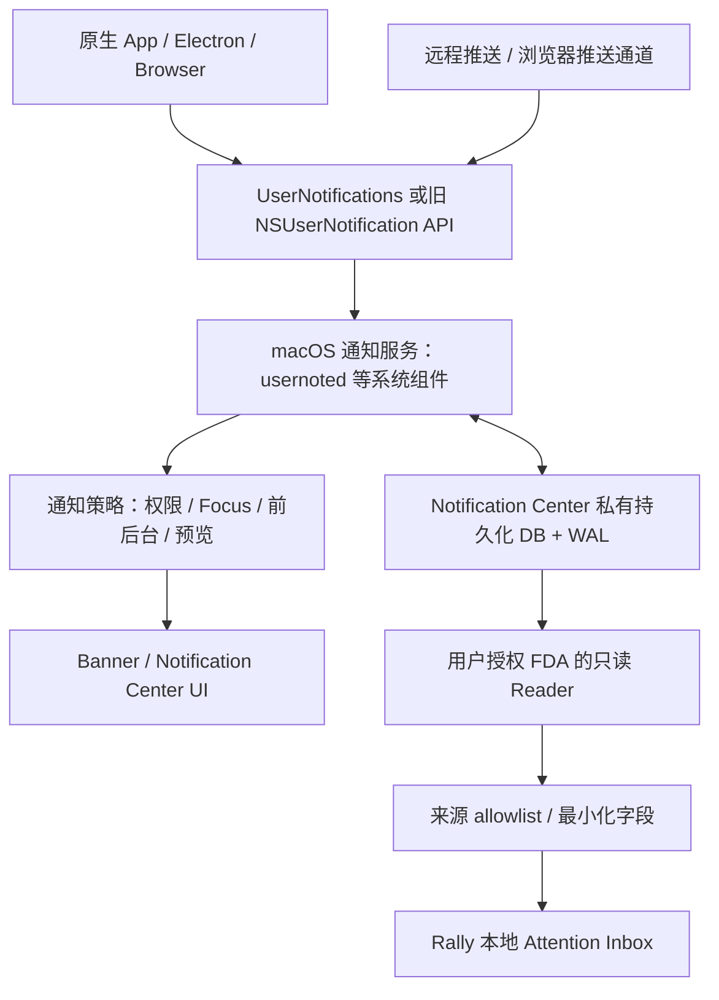

# macOS Unified Notification Monitoring

## 1. Executive Verdict

**Promising but fragile。** Notification Center DB 值得作为 Rally 的统一 ATTENTION 采集入口继续验证；目前证据不足以承诺它是 macOS 版 `UserNotificationListener`，也不足以承诺所有通知、所有版本都可靠覆盖。

推荐 **Architecture B — DB + Source Enrichment**：先用一个通用 reader 发现新的通知实例；只有需要网站、项目或会话归属时才加小型 enrichment。第一阶段允许结果只是“Antigravity 有 2 条新通知”。没有 conversation locator 不构成 capture 失败。

真正的前置条件是：目标 Mac 上 DB 可在明确 FDA 授权后只读访问，目标应用通知可及时观察，来源过滤足够准确，并且权限隔离的成本可接受。**下一步只做一次双来源、同文双实例的只读实验证明，不先开发正式 App。**

### 证据口径与适用范围

研究核验日为 2026-09-14。所有“当前源码”均指核验时版本；第三方支持声明不等于兼容性认证。

| 标签 | 含义 |
| --- | --- |
| **Verified / Official** | Apple、SQLite、Microsoft 等维护方的公开文档契约；不扩大到未公开 DB 行为 |
| **Verified / Source inspection** | 确认具体源码使用了该路径、字段或算法；不能证明在目标 Mac 上运行成功 |
| **Verified / Runtime** | 本次实际执行所得；本次只确认系统版本为 macOS **26.6.2，build 25G83**，没有读取真实通知库或触发测试通知 |
| **Reported** | README、issue、作者实验报告、既有 Human Gate；明确是谁、什么版本的报告 |
| **Inferred** | 工程判断、架构建议和实验门槛；下文所有推荐参数均属于此类 |

既有 Antigravity Human Gate 按已提供事实保留：两个不同会话产生同文原生通知，点击分别回到正确会话。本研究没有复现它。`STOP_NATIVE_LOCATOR` 与 `STOP_ANTIGRAVITY_EXACT_OPENER` 继续有效；它们不限制本次 DB capture 研究。

这份报告调整了既有研究中“先证明 activation 再推进”的优先顺序：新 MVP 只要求 app-level ATTENTION，DB 证据使独立 capture 实验有价值。原研究文件保留，不将本次判断冒充已经通过的实验或 ADR。

## 2. Why macOS behaves this way

“通知在我的电脑上”不等于“我安装的每个 App 都应该能读”。通知会把邮件摘要、验证码、聊天、日程等集中到同一个位置。如果普通 App 能随意读取，它就能绕过各来源应用原本的隐私边界。

**Verified / Official：** Apple 的 `getDeliveredNotifications` 枚举的是调用方应用仍留在通知中心的通知，而不是所有应用的通知。Microsoft 则明确提供跨应用 Notification Listener，并要求 manifest capability 和用户授权。这是两个平台公开授权接口的差异，不是 Windows 无隐私保护或 macOS 通知不可读取的证明。[^1][^2]

**Verified / Official：** macOS 的 BSD 权限、App Sandbox 与 TCC/MAC 是不同层；FDA 并不取消其他层的限制。Apple DTS 还记录了 macOS 15 起的 app group container 保护。授权 FDA 是较广的文件隐私权限，不是“只允许读取通知”的细粒度权限。[^3]

**Verified / Official：** Apple 修复过 Notification Center 日志中联系人信息泄露的问题，CVE-2025-43301；说明相关信息被当作隐私资产保护。该漏洞是日志脱敏问题，不能据此推断 FDA 读 DB 已被禁止，或某个 DB 路径已被修复。[^4]

**Inferred：** Apple 选择不公开通用通知监听接口，与上述隐私边界相符；但没有找到 Apple 官方声明“因为 X，所以永远不提供此 API”。平台设计意图只能作为解释性推断。FDA 授权下的未公开 DB 读取也不等于漏洞利用：本方案不绕过 TCC、SIP，不注入系统进程。

## 3. Current macOS Notification Architecture



这是逻辑关系图，不是已证明的每条 IPC 或严格时间顺序。不能画成“DB commit 必须先于 banner 显示”：异步写入可能让二者不同步。

**Verified / Official（本机系统手册）：** `usernoted(8)` 自称 Notification Center daemon，提供通知服务。本机没有 `usernotificationsd` 的 man 条目；这不证明该组件在所有 Apple 平台都不存在，也不支持把 iOS 进程图照搬到 macOS。UI、服务和存储职责应分开理解。

**Verified / Source inspection：** 多个现代 reader 使用以下同一路径；历史 parser 使用旧路径。这里确认的是源码，尚未确认本机目标路径可访问：

```text
macOS 15 / 26 系项目采用：
~/Library/Group Containers/group.com.apple.usernoted/db2/db
同目录可能存在 db-wal、db-shm

旧路径：
$(getconf DARWIN_USER_DIR)/com.apple.notificationcenter/db2/db
```

按 OS 与明确支持的路径表定位。旧文件可能只是升级遗留物；不要找到一个可打开的 SQLite 文件就认定它仍是活动通知库。[^5][^6]

## 4. Open-source landscape

以下日期为所核验默认分支 HEAD commit 日期（UTC），不是搜索引擎抓取时间，也不等同 release 日期。“支持”除特别说明均为作者声明。

| 项目 | 最近源码 / release | macOS 证据 | 方法 / 权限 | 公开源码与复用判断 |
| --- | --- | --- | --- | --- |
| **Notiful** | 2026-07-07；v1.1.3 2026-07-01 | README 13+；parser 注释提到 26 | DB/WAL/SHM 副本 + readonly；WAL DispatchSource + timer；FDA，AX 加速另需辅助功能 | MIT；最接近通用 watcher，但快照和去重需改，不能原样作为可靠 collector [^22] |
| **WeChat Priority Notifier** | 2026-07-10；v1.0.1 同日 | README 13+；**作者有 26.5 / 25F71 + WeChat 4.1.5 校准及 DND 实验** | 直接 readonly SQLite；8s polling、最新50条；FDA | 公开源码，API 未识别许可证，README“个人使用”；参考机制，不默认可复制 [^23] |
| **NotificationNanny** | 2026-09-05；v7.7.0 2026-08-10 | README 14/15/26 | AXObserver 观察 banner/UI；Accessibility；不是 DB/FDA reader | MIT；现代 AX 对照，不算 DB 可行性的独立证据 [^24] |
| **mac_apt** | 2026-08-21；v1.33.2 2026-07-20 | 包含 Sequoia group-container 路径及多代 schema | 取证/离线 parser；standalone readonly；读受保护 live 文件仍需相应权限 | MIT；最值得借鉴 schema 分支与异常处理，不是实时产品 [^25] |
| **Plaso** | 当前文档 20260707；未单独核验该插件最近 commit | 旧 db2 schema；不声明 Tahoe runtime | 离线 SQLite/plist parser；拿到离线样本不需 live FDA | 开源；适合 schema/fixture 参考，不为实时 watcher [^7] |
| **anotifier** | 2026-09-11；本次未核验 release | 作者 PR 有 macos-15 CI read-back 报告 | mode=ro 轮询；copy fallback；live 权限视宿主；README/CI 非本机 FDA 验证 | AGPL-3.0；适合借鉴正/负 marker 验证，含转发功能不应默认接入 [^26] |
| **ixs/notification-dump** | 2019-09-15；无 release | 旧路径；无 15/26 支持证据 | Python sqlite3+biplist，无显式 readonly、无 watcher | GPL-3.0-or-later；历史参考，非现代实现 [^27] |
| **x13a/ncdata** | 2021-11-27；2022 已归档 | Big Sur 保留期声明，旧路径 | Python library/CLI；默认 ro，有显式删除功能 | 0BSD；可借鉴记录模型，禁用/不携带删除能力 [^8] |
| **UlisseMini/notifdump gist** | 2026-01-06 revision | 现代 group-container 路径；未写明精确 tested OS | sqlite3/plutil/entr；要求 Terminal FDA；无只读 flag | 无显式许可；轻量原型参考，不照搬 [^28] |

### Notiful：可用先例与需修正部分

**Verified / Source inspection：** `NotificationDatabase.swift` 依次复制 db、wal、shm 到随机临时目录，然后以 `SQLITE_OPEN_READONLY` 打开副本；没有对原库执行 SQL 写入。`Watcher.swift` 监听 WAL 的 write/extend/delete/rename/attrib，300ms debounce，重绑定并有 timer 兜底。`Scanner` 使用 rec_id watermark 与启动时间；parser 使用 Foundation 解 `req.titl/subt/body`。[^22]

路径 fallback 不等于 schema compatibility layer：所核验代码主要依赖固定 record/app 查询，没有 mac_apt 那样明确的多代 schema 分支。按 bundle/title/body 过滤可作参考，但筛选不能消除之前已复制的其他 App 原始 BLOB。**Inferred：** 逐文件 copy 无事务一致性；以最大 ID 增量可能漏 update；读取结束不区分 SQLITE_DONE 与错误可能掩盖部分结果。应修正后才谈生产复用。

**Reported：** README 称 DB 路径约 5 秒延迟，AX 模式可即时捕获可见 banner。这不是 OS 的 SLA。源码内的临时全库副本也意味着“正文绝不写到磁盘”的绝对说法不适合沿用。

### WeChat：存在带明确版本的近期运行报告

**Verified / Source inspection：** locator 优先 group-container，再试 DARWIN_USER_DIR；SQLite flags 为 READONLY|NOMUTEX，不用 immutable，不复制 DB。reader 做有限 schema 检查并分辨 step 错误；parser 递归展开字符串字段。8 秒一次、最新 50 条的窗口仍会在突发通知下漏数据，也会先解析非 WeChat 候选，不符合 Rally 最早 SQL allowlist 的目标。[^23]

**Reported：** 2026-07-07 校准报告在 macOS 26.5 / 25F71、WeChat 4.1.5、FDA 已授权的稳定 CLI 上成功读到 group-container DB；列出具体 schema 和已脱敏字段类型。同日 DND 实验报告新增 18 行，包括 WeChat，`req.titl/body` 完整。这是“现代 Tahoe + DND 下仍可入库”的强相关一手报告；它不能推广成 Antigravity、Chrome 或所有 Focus 配置必然如此。[^29]

### NotificationNanny 为什么可能与已有 AX probe 不同

**Verified / Source inspection：** 引擎针对 `com.apple.notificationcenterui` 创建 AXObserver，持续订阅窗口创建、焦点/移动事件，并处理 banner 移动与替换。用到公开 AX 框架；目标 UI 层级、角色与可移动行为不是 Apple 稳定通知采集契约。没有发现其核心引擎通过 DB 或通用私有通知监听 API 取得全部通知。[^24]

**Inferred：** 持续观察 transient banner、选择具体进程与角色、不同系统版本/通知展示状态，都可能与一次性枚举得到不同结果。这能解释两份报告不矛盾，却不能推翻本机已经停止的 AX locator 路线。README 声称支持 Sequoia/Tahoe 是相关性证据，不证明当前 Mac 能获得两个原通知对象，更不证明 Focus 下不可见通知可被 AX 捕获。

### 搜索扩展与反例

**Reported：** anotifier PR #6 称 macos-15 CI 上 mode=ro 后 marker 约 8 秒出现；agent lane 两次在 45 秒窗口内未检出，后改为 best-effort。源码还有限制最近 20 行、raw BLOB marker 匹配与 copy fallback，因此不能把全部漏读归因于 `usernoted` 异步 commit。值得复用的是“真实 read-back + never-fired negative control”，而非它的默认采集算法。[^26]

GitHub、开发者实验记录、通知历史/安全研究、Stack Exchange 线索，以及 Raycast/Hammerspoon、ntfy/Gotify、Home Assistant 方向均做了检索。没有找到比上述项目更有说服力、覆盖本机 26.6.2 的现成全局只读 SDK；没有找到不等于不存在。

Hammerspoon 文档确有 `AXNotificationCenterAlert` 过滤示例，但不是 DB collector。`ntfy-mac`、`gotify-desktop` 是接收服务器消息后向 Mac 发通知，方向相反；Home Assistant `notify_history` 记录 HA 自身事件总线，不是任意 Mac App 通知监听。Shortcuts/AppleScript 可作为受控通知发送器，不能因能发送就当成全局读接口。Raycast 可承载已有 reader，但本次未建立独立全局通知来源证据。[^30]

## 5. Database findings

### 5.1 能取到什么

**Verified / Source inspection：** Plaso parser 的 schema 描述包含 `app`、`record`、`dbinfo`、`delivered`、`displayed`、`requests`、`snoozed`。后几张表可包含按 app 存储的 BLOB 列表，并不是都有便于 JOIN 的“每通知一行”结构。`record.data` 用 plist parser 解码；不能直接假设 `record` 表有 `title`、`body` 列。[^7]

下表所有 DB 内部名称均 **undocumented by Apple**。Verified 指被 parser 使用或 schema 描述支持，不表示在本机 26.6.2 已验证。

| 所需字段 | 已找到的表示 | 证据与可承诺范围 |
| --- | --- | --- |
| record ID | `record.rec_id` INTEGER PRIMARY KEY | Verified / Source inspection；数据库内的记录键，不是长期全局 ID |
| UUID | `record.uuid` BLOB；一些 payload 也有 UUID | Verified / Source inspection；校验长度与格式，不能假设与 request ID 相等 |
| bundle ID | `record.app_id → app.app_id → app.identifier`；payload `app` | Verified / Source inspection；二者冲突时不猜来源 |
| app identifier | `app.identifier`，可为浏览器或 helper 身份 | Verified / Source inspection；不是网站 identity 的保证 |
| delivered timestamp | `record.delivered_date` | Verified / Source inspection；常按 Cocoa epoch（2001-01-01）转 UTC，Unix 差值 978307200 秒 |
| requested / last requested | `request_date`、`request_last_date` | schema 中存在；语义与空值行为版本相关，不能用作“模型完成时刻” |
| displayed timestamp | 没有确认通用的独立列 | `presented` 是标志，不是时间；`displayed` 表也不自动提供显示时刻 |
| title / subtitle / body | plist `req.titl` / `req.subt` / `req.body` | 多个 parser 核验；可缺失、被来源裁剪或脱敏 |
| thread / category | 请求内容可能含 thread/category；WeChat 样本报告 `req.scat.id/opt` | API 有对应概念，但未建立当前所有 DB 的稳定映射 |
| request identifier | WeChat 26.5 样本报告 `req.iden`（字符串） | Reported；与 `rec_id`、UUID 是不同层，不能混用 |
| group identifier | UI grouping、thread ID、app ID 等不同概念 | 不能把同组当同一通知，也不能当 conversation ID |
| payload / userInfo | `record.data` 内的 plist；WeChat 样本报告 `req.usda` bytes | 顶层 plist 解析存在；嵌套 user data 编码与内容需再解码，不能直接假设是字符串 |
| actions | API 支持 category/actions，DB 是否完整保存需验证 | 动作标识不是可调用的跨进程 callback |
| attachments | 校准文档给出 `req.atta` array 候选；其 WeChat 27条抽样却未含附件 | Reported / 样本有限；不保证文件还存在，MVP 不读取文件或下载 URL |
| other metadata | `presented`、`style`、`snooze_fire_date` 等 | 源码/schema 可见；不解释成成功、已读、已完成 |

字段基础由 Plaso、ncdata 与现代 reader 交叉核验。Cocoa timestamp 转换也在 ncdata 工具函数中明确实现。[^7][^8]

**Verified / Source inspection：** mac_apt 根据 `dbinfo.compatibleVersion >= 17` 选择现代 record/app 分支，旧版本另读 notifications/presented_notifications 等结构，还处理部分正文为列表或本地化内容的情况。这是实际 schema compatibility 先例，而不是“只要路径一样就都能解析”。Rally 应以列/类型/编码探测选已知 adapter；OS 版本只作线索。[^25]

**同文双通知可以有不同 identity。** 数据结构支持不同 `rec_id` / UUID 对应相同 title/body。因此不要按文本 hash 去重。Antigravity 已有原生双实例 Human Gate 使这条假设很值得测；但它没有证明 DB 中一定存在两行，也没有证明其中一个键就是 conversation ID。

**Verified / Official：** 应用重复使用 notification request identifier，可以替换先前通知。Apple 规定的是通知层的替换行为，没有规定底层一定 INSERT 新行或 UPDATE 旧行。因此 `WHERE rec_id > lastSeen` 单独使用不够。[^9]

### 5.2 覆盖率：哪些问题仍需运行证据

| 场景 | 当前结论 | Rally 的处理 |
| --- | --- | --- |
| 普通桌面原生通知 | 多种来源的 DB 解析已有实现；“所有”没有官方保证 | 只对测过的来源/状态承诺覆盖 |
| Browser Web Notifications | Chromium 提交通知的源码支持统一路径 | 必须以真实 ChatGPT 通知验证，不用合成网页通知替代全部证明 |
| Electron App notifications | 使用系统通知 API 时有共用入口 | 应用未调用通知 API、仅显示内部 toast 时不在覆盖范围 |
| 前台/后台 | 官方允许前台 delegate 自行决定呈现；应用也可能根本不发通知 | 记录 producer 是否发通知；DB reader 不能补造不存在的事件 |
| Focus / DND | WeChat 26.5 作者报告 DND 下完整入库；官方无跨来源保证 | 将 suppressed、DB observed、banner visible 分开测 |
| 禁止通知 / 不显示于通知中心 | 没有全覆盖证据 | 不将空结果解释为“没有待关注消息” |
| grouping | 视觉合组不证明记录合并 | 按记录身份采集，不按 UI stack 数量 |
| update / renotify / replacement | 应用层允许替换，底层行行为不公开 | 有限重扫当前记录并比较修订，不能只推进最大 ID |
| cleared / app removed | 无当前版本立即删行的通用证据 | 尽早 ingest；系统移除不等于 Rally acknowledged |
| sleep / wake | 已落盘且仍保留的记录可能补采；未落盘不能保证 | 醒来重新枚举，记录 coverage gap |
| restart / logout | 持久库可以保留状态，不是永久事件日志 | 重启后重新识别 DB generation；不保证所有旧行仍在 |

前后台行为及通知设置范围由 Apple 文档支持；每项 DB 行为都仍是独立待测问题。[^10][^11]

### 5.3 “通知历史”到底是什么

macOS 有供用户回看仍留存通知的 Notification Center，也有内部持久化存储。**这不等于提供完整、不可删除、可恢复的 notification history 产品。** Apple 官方说明单条清除和整组清除；没有承诺清除后还可查询的历史 API。[^12]

**Reported：** ncdata README 称 Big Sur 开始约一周自动删除；这是旧实现作者的观察，不是 Apple retention policy，也不是 Tahoe 26.6.2 的实测。网上“3–7 天”“全部保留”“关闭立即删除”的说法不能合并成一个确定规则。[^8]

是否立即 DELETE、仅修改列表、延迟清理、vacuum、轮换或重建，本次没有找到当前版本完整、可复现的生命周期证据。数据库中已删除页或 WAL 中残留字节也不属于正常 SQL 可查询历史；Rally 不进行取证恢复。

**Inferred：** 按以下方式建立自己的历史：

```text
系统中当前可观察的记录
→ 一次采集，稳定去重
→ 只保存允许来源的最小化 Rally event
→ pending / acknowledged / stale
```

Rally 生成自己的事件 ID。来源去重键至少含本机/用户作用域、数据库 generation、record ID 和可用 UUID；修订另记。不能承诺系统 record ID 跨 DB 重建、账号迁移或所有重启永久唯一。删除原通知不自动确认 Rally 事件；collector 停止期间已被清除的通知可能永远补不回来。

## 6. Browser notification findings

浏览器通知不能一概当成“OS 只知道 Chrome”。现代 Chromium 源码包含可供验证的网站与 profile 元数据；**发送路径有这些字段，不等于当前 macOS DB 保留了它们**。

### 6.1 Chromium / Chrome

**Verified / Source inspection：** 普通 banner/alert provider 当前仍实例化 `MacNotificationServiceNS`；符合条件的签名 Web App shim 可使用 `MacNotificationServiceUN`。两条服务都使用 `GetMacNotificationUserInfo`，分别写到 NS notification 的 userInfo 或 UN content.userInfo。不能只看有 UN 文件就说所有 Chrome 通知均已迁移。[^31]

| 源码中的 key | 语义 | DB reader 的候选价值 |
| --- | --- | --- |
| `notificationOrigin` | origin URL | 验证是否 ChatGPT 的最重要候选 |
| `notificationProfileId` | Chromium profile ID | 同 origin 跨 profile 去歧义；不是 tab/conversation ID |
| `notificationId` | Chromium 通知 ID | 平台通知关联；业务语义需另证 |
| `notificationIncognito` | 是否隐私模式 | 建议默认排除，不落库 |
| `notificationUserDataDir` | user data 根目录 | 敏感本地路径；只在内存处理，不输出完整路径 |
| `notificationType` / `notificationHasSettingsButton` | 内部类型/UI 元数据 | 非 MVP 所需，默认丢弃 |

源码还构造 `r|profile-id|notification-id` 或 `i|profile-id|notification-id` 的平台 ID，并在读取自身 delivered notifications 时反向解析 userInfo。这比只看发送代码更强，但依然没有证明第三方能从本机 DB 提取同样字典。已安装 PWA 的 OS bundle 可能是 Web App shim，而非固定 `com.google.Chrome`。[^31]

### 6.2 Electron 与 Safari/WebKit

**Verified / Source inspection：** Electron 当前 `CocoaNotification::Show` 使用 UN，设置 title/subtitle/body、可选 group→thread、actions/category 等，request identifier 来自 notification ID；该默认函数没有写入 Chrome 那套 origin/profile userInfo。不能因为 Antigravity/Cursor 等基于 Electron，就推断它们通知携带 Chromium 网站字段。具体 App 还可能用不同 Electron 版本或自定义模块。[^32]

**Verified / Source inspection：** WebKit 的公开 webpushd UN 路径把 `NotificationData.dictionaryRepresentation()` 写入 userInfo；其中可有 `WebNotificationOriginKey`、`WebNotificationServiceWorkerRegistrationURLKey`、UUID、context UUID、session、tag、data 与 default action URL。其 notification bundle 可采用 `com.apple.WebKit.PushBundle.<partition>`；另外也存在交给 embedder 回调的路径，不能代表 Safari 所有闭源实现。[^33]

**未验证项：** 本次没有找到把上述浏览器 userInfo 与明确 OS/browser build 的真实 DB 行逐字段对应的一手样本。因此 Chrome/ChatGPT 的 origin、profile、SW metadata、request ID、icon/attachment 在当前 DB 中的保留率均待验证。`req.usda` 等嵌套 bytes 是应该检查的候选，不应把“顶层没有 origin”直接判断为整个 payload 没有 origin。

SW scope、context UUID、notification tag 都不是可靠 conversation opener。即便出现 URL，也只作为未经执行的 hint；缺少账号/profile、失效或格式不受信任时不导航。

识别规则应分三层：

1. SQL 按浏览器/通知 helper 的实际 bundle identifier 筛选候选。
2. 在 reader 内解析有限字段，验证 URL scheme、hostname、origin 和可选 profile；默认不保存完整 URL/path/profile 目录。
3. 只有可信 origin 与明确 allowlist 匹配才标记 ChatGPT；title 中写着“ChatGPT”不能证明网站来源。

若 DB 没有可用 origin：用户可明确选择仅接收“Chrome 有新通知”的 metadata 事件；若要求只收 ChatGPT，则默认丢弃来源不明的浏览器候选，或使用独立 browser provider。不能以允许 Chrome 为由持久保存所有网站正文。

Browser enrichment 可独立补充网站/项目/会话，但必须有可靠共同键才合并到某条 DB event。仅凭到达时间、当前前台 tab 或相同正文配对会串线；没有键时保留 browser-level ATTENTION，或让 browser provider 自行生成事件。

## 7. Recommended acquisition implementation

### 7.1 六种办法并不是互斥候选

Polling、WAL watcher、FSEvents/DispatchSource 是“何时读”；SQLite readonly、backup、文件 copy 是“怎样读”。需要分别选择。

| 方法 | 优点 | 主要边界 | 建议 |
| --- | --- | --- | --- |
| SQLite polling | 简单，容易测量，不依赖文件事件完备性 | 查询频率与唤醒成本；仍受系统 commit 延迟影响 | 最小实验先采用；生产作兜底 |
| 监听 `db-wal` | 能及时发现可能的写入 | checkpoint、rename、删除重建；一次写不等于一条已提交通知 | 作为 hint，不能直接生成事件 |
| FSEvents / DispatchSource vnode | 原生文件变化通知；可监听目录补足替换 | 事件合并/丢失；必须重扫、重新挂 watcher | 生产采用目录+WAL watcher，加低频 polling |
| SQLite update-hook | 对本连接写入有回调 | 看不到 Apple 另一个进程/连接的写入 | 不适用；wal-hook 也不是跨进程订阅 |
| 顺序复制 db/wal/shm 再读取 | 原库不执行 SQL，副本可分析 | 三文件不是原子快照，复制期间 checkpoint/写入会混合状态；还会复制非允许来源内容 | 不作为推荐默认路径 |
| SQLite Online Backup API | SQLite 协调生成一致快照，可复制到内存 | 全库扫描成本、读锁时段、持续写入下重试；仍须打开原库 | 必须隔离解析时的备选，受时间/大小限额控制 |

SQLite 明确说明 update-hook 属于具体连接；Apple 文档说明文件事件可能合并/丢失，需要重新扫描。Dispatch 应使用 filesystem/vnode source，而不是表示“可写就绪”的普通 write source。[^13][^14]

**关键纠正：** `copy db → copy wal → copy shm` 只证明没有主动写源文件，不证明三者来自同一个瞬间。副本通过 `quick_check` 也不能证明它包含了全部最新提交。单独 APFS clone 每个文件同样不自动得到跨文件事务快照。SQLite 推荐其协调的备份方式。[^15][^16]

### 7.2 最低成本路径

**Inferred：** 第一次实验使用原生 Swift 小程序、系统 SQLite 与 Foundation plist parser。只用 polling；通过之后才加 watcher 和后台包装。

```text
固定允许的系统 DB 路径
→ SQLITE_OPEN_READONLY（不创建 DB）
→ 验证 schema 指纹 / 已知字段类型
→ 一个短 SELECT：按 bundle allowlist 限定结果
→ 立即结束 statement / 释放 read transaction
→ 在内存解码有限候选 payload
→ origin 二次过滤、字段最小化
→ 本地 normalized AttentionEvent
```

生产起始参数可为：WAL/目录事件合并 250–500ms，另每 5s 检查变化；短查询 busy timeout 100ms、总工作预算 200ms，超出退出本轮并退避。这些是待调参数，不是性能结论。最小实验可每 500ms polling，便于测量系统入库延迟。

在同一个长寿命连接上可用 `PRAGMA data_version` 判断别的连接是否提交变化，但它不是 durable event cursor；新建连接的数值不能与旧连接比较。连接常驻不意味着读事务常驻，必须及时 finalize/commit。[^17]

用参数绑定的查询先筛选 bundle，返回有界批次。实验可反复扫描时间盒内所有允许来源记录，避免“最新 50 条”截断；生产以分页新记录加周期性当前集合重扫处理更新/删除。排序使用稳定组合键；游标在成功写入 Rally 本地队列后才推进。启动先建 baseline，默认不把现有全部历史当新通知。

重建 DB、schema 改变、权限撤销、解析失败、行数超预算、轮询间隔出现缺口，都要有独立 health 状态。未知 schema 停止输出该来源，显示“采集不可用/覆盖不完整”，不输出“暂无新消息”。不能通过忽略异常再推进游标而悄悄丢事件。

### 7.3 不修改 DB 的严格含义

**Verified / Official：** WAL 模式允许读者与写者并行，但长读事务可能阻碍 checkpoint 回收；readonly WAL 打开也有 sidecar 条件。因此只读不等于完全无锁、完全零影响。`immutable=1` 声明文件永不变并跳过锁与变化检测，不能用于活跃系统库；也不要用 `nolock=1` 绕过协调。[^18][^19]

禁止业务写入、DDL、journal mode 更改、VACUUM、手动 checkpoint、删除 sidecar、暂停/kill `usernoted`。用只读 open flag，加 SQL authorizer/固定查询作为纵深限制；`query_only` 只是补充，不能替代只读打开。

**需要明确的工程边界：** `SQLITE_OPEN_READONLY` 限制数据库写入，但某些 SQLite/VFS 状态下可能涉及共享内存协调或 sidecar 处理。若硬约束解释为“连 sidecar 都不得有任何写系统调用”，需要单独证明当前 VFS/打开方式；不能仅凭 readonly 名字保证。若不能在该约束下安全一致地读取，则停止此实现，不能偷偷改用 immutable 或非原子 copy。

默认直接 SELECT 的另一优势是无需复制全库到 Rally 管理的临时文件，能更早过滤隐私数据。需要 snapshot 时优先考虑限时内存 backup，再解析；但完整副本进入内存本身仍扩大暴露面，不是免费安全措施。

## 8. Security architecture

### 8.1 FDA 隔离能做，但不是“拆子进程就完成”

**Verified / Official：** Apple 的 responsible-code 机制常把 helper 的文件操作归属于所属 App；脚本则容易归属于解释器或启动它的 Terminal。稳定代码签名有助于更新后识别同一程序，裸路径或临时 ad-hoc 签名不能当作稳定授权身份。[^3]

**Inferred：** 正式路线采用独立可见、独立签名的 `Rally Notification Reader.app`，拥有自己的 bundle identity 和用户 FDA 授权。Rally UI 不请求 FDA。通过用户级登录启动方式运行 reader；若采用 LaunchAgent / SMAppService，必须测试 responsible-code 实际归属，不能默认嵌入主 App 的 helper 获得独立 TCC 边界。[^20]

| 选项 | 适用性 |
| --- | --- |
| Terminal 内 Python/Node 脚本 | 可一次性诊断；给 Terminal/解释器 FDA 会扩大其他脚本的权限，不推荐持续部署 |
| 独立 CLI Mach-O binary | 易做小型实验；签名、可见授权入口、启动归属和更新仍要处理 |
| 独立签名 native reader app | 首选正式包装候选；Swift + SQLite + Foundation 可减少依赖和动态执行入口 |
| 用户级 LaunchAgent | 可做登录后持续采集，不需要 root；属于生命周期机制，不是权限隔离机制 |
| root LaunchDaemon / privileged helper | 本需求不需要；也不能绕过 TCC，增加部署负担 |
| sandbox + FDA | 两层都要满足；FDA 不自动打穿 App Sandbox。未验证之前，不承诺 Mac App Store 分发可行 |

原生 Swift 的优势主要是可审计、依赖少、可用稳定签名与原生 plist 解码；并不是 Swift 比 Python 天生少 FDA 权限。固定签名身份的正常升级有利于保留授权，但改 bundle ID、签名 requirement、安装位置或启动归属后的实际行为仍要测试；不保证更新永不重新授权。

### 8.2 权限大、代码行为小

reader 只接受固定 schema 的配置，不接受任意 SQL、任意文件路径、shell 命令或动态插件。路径限定到本用户既知 notification DB；拒绝符号链接替换和非预期文件类型。未知 payload 限制大小、嵌套深度、条目数；只做数据解码，不实例化任意归档类，不执行 notification action。

对 UI 仅提供“读取规范化事件/健康状态”接口。通过受约束 XPC 或本机 Unix socket 验证 peer identity；避免任意本地网页可读的无认证 HTTP 服务。UI 不能请求 reader 代读其他文件。collector 自身无网络上传、无远程日志、无动态代码入口；通知正文不能当 shell、HTML 或 AI 指令执行。

**局限：** 路径 allowlist 是程序行为约束，不是 FDA 本身变成了单文件 capability。reader 若被攻破，仍可能滥用广泛授权；独立进程与窄 IPC 主要减少 UI 漏洞扩散，不能消除授权风险。运行时确认“UI 不能读原 DB、reader 可以、撤销 reader FDA 后立即失败、升级后归属正确”才算隔离验收。

### 8.3 正文是否需要持久保存

默认 **不保存正文**。推荐事件最小集合：Rally event ID、来源 bundle、可验证网站 origin 的规范化 host、观察时间、可用 delivery 时间、去重 token、pending/acknowledged/stale。UI 可以直接显示“Antigravity 有新通知”。

title 本身也可能含姓名或机密信息；如需标题/80 字 preview，由用户按来源开启、默认短期保留并支持立即清除。禁止把“只保存 preview”宣传为已自动剔除验证码；任意截断无法可靠去敏。

SQL JOIN 可以在将 payload 返回应用前筛掉其他 bundle；随后在内存对浏览器 origin 筛选，最后才持久化。这能做到 **drop before Rally persistence**，但不能声称 SQLite 从未在内存页缓存读过相邻行，也不能避免系统原库本来就保存的内容。

生产不保存 raw plist、完整 DB 副本、附件、profile/user-data 路径或完整 URL query。未知 bundle 默认拒绝。真实 bundle ID 以本机安装与受控通知实验确认；题目中的示例不能直接当生产配置。建议默认 7 天本地事件保留、可修改；这是 Rally 自己的产品策略，与系统保留期无关。

## 9. Runtime experiment：一个双来源、同文双实例实验

**目标：** 在本机 26.6.2 上，用同一个只读程序验证 Antigravity 和真实 ChatGPT Browser 通知的 capture、来源、字段、identity、latency。时间盒建议 60–90 分钟；不开发正式 App，不复做 AX/原通知点击代理。

### 实验准备

记录 OS/build、CPU 架构、浏览器与目标 App 版本、通知开关、Focus、前后台、预览设置、实际 bundle IDs、`sqlite3_libversion()`。使用独立本地测试内容，不导出现有私人通知。reader 默认只查询事先确定的 bundle；浏览器候选仅内存解析，未知 origin 不落盘。

reader 首先只检查 schema/只读连接和 baseline：保存允许来源现有的记录身份到内存，之后才启动测试。权限被拒绝输出明确 error category；由用户在系统设置授予真正负责进程 FDA 后再试。不要以给整个 IDE/Terminal 长期 FDA 作为正式隔离验证。

读循环每 500ms 运行短事务，保存测试窗口内候选的身份和字段，观察至少 60 秒才判某次 missed。既有历史不回填。对同文测试只记录长度或相等性/HMAC；对合成 canary 内容可记录明文，证明 title/body 解码。普通第三方通知只统计拒绝数量，不落正文。

### 单次实验中的顺序

| 步骤 | 操作 | 必须得到的证据 |
| --- | --- | --- |
| 1 | 同时准备 Antigravity A/B 两会话、ChatGPT Browser C；通知开启且应用后台 | 所有应用/网站身份及设置已记录 |
| 2 | Antigravity A/B 各触发同文通知；至少做 3 对 | 每对为两个独立 DB identity；不按正文合并；不要求映射到 A/B |
| 3 | ChatGPT 实际后台任务触发通知，至少 3 次 | 实际 OS bundle，title/body 解析；origin/profile/request 字段是否存在及类型 |
| 4 | 同一 browser 用一个不在 allowlist 的受控网站发 canary；另让两目标交错发通知 | 非 ChatGPT 网站不持久化；不同来源不串线 |
| 5 | 保留通知，然后仅清除一条，再清除一组；每次重查 | 区分 record 消失、字段变化、列表变化；Rally 事件仍独立存在 |
| 6 | reader 重启一次；前台、Focus 开启时各补一次；短暂睡眠/唤醒后重查 | 去重、状态差异、恢复与缺口；结果不足即标未验证 |

这些步骤属于同一个 acquisition spike 的测试矩阵。若 ChatGPT 当时不产生真实 OS 通知，合成 Web Notification 仅能验证 browser plumbing，不能把 ChatGPT 行写成通过；无需在本实验逆向其发通知机制。

### 时间与结果格式

至少区分 `producerTriggeredAt`（能测则记录）、`bannerSeenAt`（人工可选）、`dbDeliveredAt`（系统字段）、`collectorFirstSeenAt`（墙钟+单调时钟）。采集延迟优先计算 firstSeen−trigger；没有 producer 时钟时明确标成 firstSeen−人工观察的近似值。firstSeen−delivered 是另一个指标，不能冒充系统端到端延迟。

```text
caseId, sourceBundle, verifiedOrigin?, sourceRecordToken,
uuidPresent, requestIdPresent, titleParsed, bodyParsed,
sameTextAsPairedCase, triggerAt?, bannerSeenAt?, deliveredAt?,
firstSeenAt, latencyBasis, latencyMs?, duplicateCount, result
```

输出只含允许来源测试结果、schema 字段/类型、聚合性能和错误；不保存完整库或未知 userInfo。测 reader CPU、单轮 SQL 耗时、WAL 大小趋势与 Notification Center 是否仍正常工作。不能通过“前后 DB hash 变了”认定 reader 写库，因为 Apple writer 一直在工作；检查只读 flag/SQL authorizer、可用的文件系统调用观测与实际副作用才有意义。

**建议通过门槛：** 正常后台且实际发出通知的 6 个 Antigravity、3 个 ChatGPT 样本全捕获；同文实例不合并，来源误归属 0、禁止来源持久化 0、重启重复 0。探索性时延目标中位数 ≤5s、最大 ≤15s；小样本不能作为 p95 SLO。Focus/前台/醒来差异完整记录，不把没有发送的通知计作 DB 漏读。后续生产可靠性还需要多日运行和版本矩阵。

## 10. Stop / Pivot Criteria

| 观察结果 | 决定 |
| --- | --- |
| 正确 FDA 与部署归属下仍不可读，或必须 root / SIP disable / 私有 entitlement 绕过 | 停止 DB 实现，转明确来源 provider |
| 要求无 sidecar 写入却无法证明安全一致读取 | 停止当前读法；不接受 immutable / 裸 copy 伪装解决 |
| 两条同文 OS 通知无法可靠观察为两个实例 | 保留 app-level “有新消息”可能仍有用；若实例计数为硬需求则降级/转 provider |
| Antigravity 可捕获，ChatGPT 不发 OS 通知或记录缺失 | 保留 IDE DB collector，Browser 单独 provider；不必全盘否定 DB |
| 浏览器有通知但无可信 origin，且用户不接受 Chrome 整体通知 | Browser enrichment/独立 provider；禁止 title 猜源 |
| 正常后台重复漏读，或实际延迟长期大于用户可接受值 | DB 仅补充/恢复源；直接来源事件作为主要入口 |
| schema/权限升级频繁破坏采集，维护超过预算 | 撤回“低维护”假设，转 C 或成熟工具的受限接口 |
| 只有全库持久备份、全量正文日志才能工作 | 不符合隐私模型，停止该实现 |
| reader 明显增大 WAL、阻碍 checkpoint、系统通知卡顿 | 立即停 reader；缩短事务后仅在隔离测试重试 |
| 用户不愿 FDA，或独立 reader 授权归属无法稳定验证 | 不推广 FDA 路线；采用显式来源接入 |
| 仅原生 click replay 不可行 | **不停止 capture**；app launch/hint 可选，exact open 保持 unavailable |

## 11. Architecture comparison and reuse recommendation

| 架构 | Capture | Identity | Locator / click | 成本与选择 |
| --- | --- | --- | --- | --- |
| A — DB First | 一条入口覆盖已入库来源 | DB 局部记录身份，有更新/重建问题 | app hint；不保证会话或 native replay | 可做最小 capture MVP，但必须注明覆盖范围 |
| B — DB + Source Enrichment | 统一发现，来源可渐进补充 | 独立 attention instance；有可靠键才 enrich | 按已证明 provider 能力补网站/项目/会话 | **推荐目标架构**，第一次实验只验证 DB 核心 |
| C — Per-source provider | 取决于来源公开接口，可绕开没有 OS 通知的问题 | 可能更接近任务/会话 identity | 来源支持时可更精确 | FDA 不接受或 DB 覆盖差时 pivot；不必一开始给所有 App 开发 |
| D — Existing tool collector | 更快验证，可能已有 watcher/UI | 受其去重/更新规则约束 | 转发内容不继承原始 callback | 需审核外发、正文持久化和不可逆动作，不能直接信任默认配置 |
| E — 显式来源发布到本地小队列 | 来源主动发布，不读系统聚合库 | 发布时可带稳定 ID | 发布方明确提供才有 | 不愿 FDA 时合理；本质仍需要来源合作 |

四项价值独立判断：**Capture 有希望减少轮询；Identity 有可用的记录级候选；Locator 可能有 app/origin hint；Native click replay 没有可承诺接口，也不是本 MVP 必需品。** 从 DB 读到 actions/userInfo 或生成一条新通知，都不会自动继承 Antigravity 原回调。

推荐 **参考现有 parser 与测试样本，自己实现极小只读 collector**，而非原样 fork 一个包含 UI、转发、AX 自动动作的完整工具。SQLite 与 Foundation 已承担数据库及 plist 的通用工作；Rally 只实现受限路径、schema adapter、allowlist、身份与健康状态。不是从零实现 SQLite/WAL/parser。

Swift 可直接用系统 SQLite/PropertyListSerialization；Python 的 sqlite3/plistlib 适合诊断，ncdata/mac_apt/Plaso 可作 schema 参考。没有找到可直接承诺现代 macOS 全局通知采集兼容性的成熟通用 Swift package 或 Rust crate；`mac-usernotifications` / `mac-notification-sys` 等主要包装发送和自身通知响应，不是读其他应用的 DB SDK。[^21]

正式代码按自然职责分为路径/权限、只读查询、payload adapter、event normalization 等小模块，遵守仓库优先 100–300 行、人工代码不超过 600 行的约束。最小实验成功前不搭完整架构。

## 12. Final Recommendation

**如果只允许 IDE 做一个实验：做第 9 节的“Antigravity 同文双实例 + 真实 ChatGPT Browser”的统一只读 DB capture spike。**

只回答五件事：当前 Mac 能否读、能否分源、能否解码、能否区分同文实例、多久能看见。通过后再决定是否包装独立 FDA reader，并把 DB 当作可失效的 ATTENTION 来源；未通过就按具体失败项 pivot。不要把成功条件重新扩大成 native click replay 或 semantic completion。

## Sources

下列在线资料均于 2026-09-14 核验；未标日期的 API 页面是动态文档。固定 commit 链接用于保留源码审查版本。源码/第三方运行结果均不替代本机实验。

[^1]: Apple, [getDeliveredNotifications](https://developer.apple.com/documentation/usernotifications/unusernotificationcenter/getdeliverednotifications(completionhandler:))：仅自身 App 的仍留存通知。
[^2]: Microsoft, [Notification listener: Access all notifications](https://learn.microsoft.com/en-us/windows/apps/develop/notifications/app-notifications/notification-listener)，页面更新 2026-07-15：跨应用范围与授权。
[^3]: Apple DTS, [On File System Permissions](https://developer.apple.com/forums/thread/678819)，修订 2025-11-04：多层权限、responsible code、脚本与签名。
[^4]: Apple, [Security content of macOS Sequoia 15.7](https://support.apple.com/en-us/125111)：Notification Center / CVE-2025-43301，日志隐私脱敏。
[^5]: 现代 Notification Center DB readers，见第 4 节各固定版本源码。
[^6]: x13a, [ncdata.py](https://github.com/x13a/ncdata/blob/60ee72c285e5d0a5c9f187dcc062df73138c01b1/ncdata/ncdata.py)，2021-11-27：旧路径、记录模型、筛选及删除方法。
[^7]: Plaso/log2timeline, [macos_notification_center parser](https://plaso.readthedocs.io/en/latest/_modules/plaso/parsers/sqlite_plugins/macos_notification_center.html)，文档版本 20260707：schema、Cocoa time 与 plist 字段。
[^8]: x13a, [ncdata README](https://github.com/x13a/ncdata/blob/60ee72c285e5d0a5c9f187dcc062df73138c01b1/README.rst)、[utils.py](https://github.com/x13a/ncdata/blob/60ee72c285e5d0a5c9f187dcc062df73138c01b1/ncdata/utils.py)：旧版本保留期声明、默认只读与时间转换。
[^9]: Apple, [UNNotificationRequest initializer](https://developer.apple.com/documentation/usernotifications/unnotificationrequest/init(identifier:content:trigger:))：同 identifier 替换行为。
[^10]: Apple, [Handling notifications and notification-related actions](https://developer.apple.com/documentation/usernotifications/handling-notifications-and-notification-related-actions)：前台呈现决策。
[^11]: Apple, [Notifications settings on Mac](https://support.apple.com/guide/mac-help/notifications-settings-mh40583/mac)：Focus 相关设置、显示范围、预览与 grouping。
[^12]: Apple, [Use Notification Center on Mac](https://support.apple.com/en-sa/guide/mac-help/mchl2fb1258f/mac)：用户可回看与清除通知。
[^13]: SQLite, [Data Change Notification Callbacks](https://www.sqlite.org/c3ref/update_hook.html)：连接级 update hook。
[^14]: Apple, [Using the File System Events API](https://developer.apple.com/library/archive/documentation/Darwin/Conceptual/FSEvents_ProgGuide/UsingtheFSEventsFramework/UsingtheFSEventsFramework.html)、[DispatchSourceFileSystemObject](https://developer.apple.com/documentation/dispatch/dispatchsourcefilesystemobject)：文件事件与重新扫描。
[^15]: SQLite, [How To Corrupt An SQLite Database File](https://sqlite.org/howtocorrupt.html)，§1.2–1.4：在线复制与不匹配 journal 风险。
[^16]: SQLite, [Online Backup API](https://www.sqlite.org/backup.html)：一致备份、增量复制、重试与锁定边界。
[^17]: SQLite, [PRAGMA data_version](https://sqlite.org/pragma.html#pragma_data_version)：同连接上的变化检测。
[^18]: SQLite, [Write-Ahead Logging](https://www.sqlite.org/wal.html)：reader/writer、checkpoint 与 readonly 条件。
[^19]: SQLite, [URI filenames](https://sqlite.org/uri.html)：`mode=ro`、`immutable` 与 `nolock`。
[^20]: Apple DTS, [Helper tool attribution / Login Items](https://developer.apple.com/forums/thread/721441)：SMAppService 与 responsible-code 归属背景；不是独立 FDA 隔离认证。
[^21]: Rust crate maintainers, [mac-usernotifications](https://docs.rs/mac-usernotifications/latest/mac_usernotifications/)、[mac-notification-sys](https://docs.rs/mac-notification-sys/latest/mac_notification_sys/)：发送、自身响应与打包要求。
[^22]: ptrinh, Notiful，commit `c2b4d8e21044facd23bdf9bed8ef323e481bb4ec`，2026-07-07：[README](https://github.com/ptrinh/Notiful/blob/c2b4d8e21044facd23bdf9bed8ef323e481bb4ec/README.md)、[NotificationDatabase.swift](https://github.com/ptrinh/Notiful/blob/c2b4d8e21044facd23bdf9bed8ef323e481bb4ec/Sources/NotifulCore/NotificationDatabase.swift)、[NotificationRecord.swift](https://github.com/ptrinh/Notiful/blob/c2b4d8e21044facd23bdf9bed8ef323e481bb4ec/Sources/NotifulCore/NotificationRecord.swift)、[Watcher.swift](https://github.com/ptrinh/Notiful/blob/c2b4d8e21044facd23bdf9bed8ef323e481bb4ec/Sources/Notiful/Watcher.swift)、[Scanner.swift](https://github.com/ptrinh/Notiful/blob/c2b4d8e21044facd23bdf9bed8ef323e481bb4ec/Sources/NotifulCore/Scanner.swift)。
[^23]: Ngaizean, WeChat Priority Notifier，commit `0db8066ddbd4e4545182b83f5ded733792e02e86`，2026-07-10：[README](https://github.com/Ngaizean/wechat-priority-notifier/blob/0db8066ddbd4e4545182b83f5ded733792e02e86/README.md)、[SQLiteConnection](https://github.com/Ngaizean/wechat-priority-notifier/blob/0db8066ddbd4e4545182b83f5ded733792e02e86/Sources/WeChatPriorityNotifierCore/SQLiteConnection.swift)、[Reader](https://github.com/Ngaizean/wechat-priority-notifier/blob/0db8066ddbd4e4545182b83f5ded733792e02e86/Sources/WeChatPriorityNotifierCore/NotificationRecordReader.swift)、[PayloadParser](https://github.com/Ngaizean/wechat-priority-notifier/blob/0db8066ddbd4e4545182b83f5ded733792e02e86/Sources/WeChatPriorityNotifierCore/PayloadParser.swift)、[MonitorEngine](https://github.com/Ngaizean/wechat-priority-notifier/blob/0db8066ddbd4e4545182b83f5ded733792e02e86/Sources/WeChatPriorityNotifierApp/MonitorEngine.swift)、[Locator](https://github.com/Ngaizean/wechat-priority-notifier/blob/0db8066ddbd4e4545182b83f5ded733792e02e86/Sources/WeChatPriorityNotifierCore/NotificationDatabaseLocator.swift)。
[^24]: chessper53, NotificationNanny，commit `9cf4ebb450bde8a12da15b7240799820f0e158c1`，2026-09-05：[README](https://github.com/chessper53/NotificationNanny/blob/9cf4ebb450bde8a12da15b7240799820f0e158c1/README.md)、[NotificationRepositioner](https://github.com/chessper53/NotificationNanny/blob/9cf4ebb450bde8a12da15b7240799820f0e158c1/Sources/NotificationNannyCore/Engine/NotificationRepositioner.swift)。
[^25]: ydkhatri, mac_apt，commit `0edb4cd4f2ca4675f0d2ce02a9700bc32f7db43f`，2026-08-21：[notifications.py](https://github.com/ydkhatri/mac_apt/blob/0edb4cd4f2ca4675f0d2ce02a9700bc32f7db43f/plugins/notifications.py)、[common.py](https://github.com/ydkhatri/mac_apt/blob/0edb4cd4f2ca4675f0d2ce02a9700bc32f7db43f/plugins/helpers/common.py)、[macinfo.py](https://github.com/ydkhatri/mac_apt/blob/0edb4cd4f2ca4675f0d2ce02a9700bc32f7db43f/plugins/helpers/macinfo.py)。
[^26]: DevinoSolutions, anotifier，[macos-delivery.mjs](https://github.com/DevinoSolutions/anotifier-for-claude-codex-cursor/blob/9b9af5d041d2bd3d01a6679c61a9c76c1ba451da/src/platforms/macos-delivery.mjs)，commit 2026-09-11；[PR #6](https://github.com/DevinoSolutions/anotifier-for-claude-codex-cursor/pull/6)，作者 CI 实验叙述，未由本研究复现。
[^27]: ixs, [notification-dump / dump-notif.py](https://github.com/ixs/notification-dump/blob/4eeae4b03050a39e3d57b2d3cb4207e1509c10e9/dump-notif.py)，2019-09-15。
[^28]: UlisseMini, [notifdump gist 固定 revision](https://gist.github.com/UlisseMini/6f7100bb45c0f7b8becc6a44e6121cff/7e2f7ef0227614af4e0a461c0ffb0f00058d98ec)，2026-01-06。
[^29]: Ngaizean，2026-07-07，[真实 WeChat 通知字段校准记录](https://github.com/Ngaizean/wechat-priority-notifier/blob/0db8066ddbd4e4545182b83f5ded733792e02e86/research/live-calibration.md)、[免打扰模式对照实验](https://github.com/Ngaizean/wechat-priority-notifier/blob/0db8066ddbd4e4545182b83f5ded733792e02e86/research/dnd-experiment.md)：作者报告 26.5 / 25F71；文档关于 FDA 绑定路径/inode 的归因不作为 Apple 契约采用。
[^30]: 各项目自身文档：[Hammerspoon window filter](https://www.hammerspoon.org/docs/hs.window.filter.html)、[jkrumm/ntfy-mac](https://github.com/jkrumm/ntfy-mac)、[desbma/gotify-desktop](https://github.com/desbma/gotify-desktop)、[remmob/notify_history](https://github.com/remmob/notify_history)：区分 AX、向 OS 发送及 HA 内部事件日志。
[^31]: Chromium，main 快照 `ab73a21c5e437b6005c0195e8a1cc6d14c17821b`：[NS service](https://github.com/chromium/chromium/blob/ab73a21c5e437b6005c0195e8a1cc6d14c17821b/chrome/services/mac_notifications/mac_notification_service_ns.mm)、[UN service](https://github.com/chromium/chromium/blob/ab73a21c5e437b6005c0195e8a1cc6d14c17821b/chrome/services/mac_notifications/mac_notification_service_un.mm)、[userInfo/ID utils](https://github.com/chromium/chromium/blob/ab73a21c5e437b6005c0195e8a1cc6d14c17821b/chrome/services/mac_notifications/mac_notification_service_utils.mm)、[provider](https://github.com/chromium/chromium/blob/ab73a21c5e437b6005c0195e8a1cc6d14c17821b/chrome/services/mac_notifications/mac_notification_provider_impl.mm)、[app shim](https://github.com/chromium/chromium/blob/ab73a21c5e437b6005c0195e8a1cc6d14c17821b/chrome/app_shim/app_shim_controller.mm)。核验时源码不等同本机 Chrome build。
[^32]: Electron，快照 `b260e07d9ce0465d0687acf4c6e8044782c9430d`：[cocoa_notification.mm](https://github.com/electron/electron/blob/b260e07d9ce0465d0687acf4c6e8044782c9430d/shell/browser/notifications/mac/cocoa_notification.mm)、[notification_presenter.cc](https://github.com/electron/electron/blob/b260e07d9ce0465d0687acf4c6e8044782c9430d/shell/browser/notifications/notification_presenter.cc)。
[^33]: WebKit，快照 `f45cdb1e659fdee5d8fee651626e707455521485`：[WebPushDaemon.mm](https://github.com/WebKit/WebKit/blob/f45cdb1e659fdee5d8fee651626e707455521485/Source/WebKit/webpushd/WebPushDaemon.mm)、[NotificationDataCocoa.mm](https://github.com/WebKit/WebKit/blob/f45cdb1e659fdee5d8fee651626e707455521485/Source/WebCore/Modules/notifications/NotificationDataCocoa.mm)、[PlatformHave.h](https://github.com/WebKit/WebKit/blob/f45cdb1e659fdee5d8fee651626e707455521485/Source/WTF/wtf/PlatformHave.h)、[WebNotificationProvider.cpp](https://github.com/WebKit/WebKit/blob/f45cdb1e659fdee5d8fee651626e707455521485/Source/WebKit/UIProcess/Notifications/WebNotificationProvider.cpp)。
