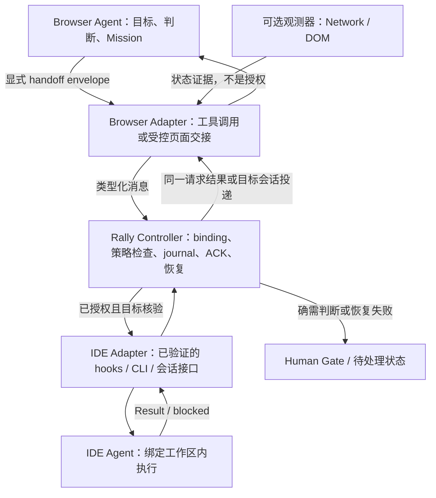

# Browser-IDE Rally 全程复盘与独立架构审查

## A. Executive Verdict

**Overall direction: NEEDS MATERIAL CORRECTION。**

Rally 的目标正确，模块化和来源直接观测值得保留；但当前路线仍把“看见一次回答结束”当作“可以安全交接任务”的主要代理指标。最大的风险已经不是检测延迟，而是错误归属、错误续跑、丢失交接和无法恢复。继续补几条普通生成样本，不能解决这些问题。

**Tampermonkey 是合理的廉价观测适配器，但尚未证明是最小整体系统的最佳入口。** 应先用一个有边界的实验比较“ChatGPT 显式调用 Rally 工具 → 已绑定 IDE → 结构化结果返回”与“被动观察所有生成 → 推断交接”。官方 MCP 能力已经使前者成为必须认真验证的候选；它仍不能被宣称为已解决长任务后的无人唤醒。

**当前 `be4f02c` 不应标记 Phase 3 READY，更不能 PASS。** 六组本地反例已经复现，包括第二轮丢失、身份丢失、ID 误提取、Stop 被误报完成，以及指标自我验收。源码小文件化没有消除这些语义错误。

### 审查基线与证据纪律

核验日期：2026-09-15，Asia/Shanghai。审查对象是从初始 Relay 目标、Notification／Attention 分支到当前 Phase 3 的需求、文档、远程讨论和源码。没有安装候选 userscript，没有向真实 ChatGPT 会话发送测试任务，没有实现 Relay，也没有修改远程 Issue 或发布代码。

| 证据类别 | 本次确认的内容 | 不能扩大的结论 |
| --- | --- | --- |
| **Verified — repo / remote** | 本地 HEAD 与远程技术分支为 `be4f02ca94bf2753836187fca34b7d8a77530275`；模块化提交已存在且已推送；Issue #1、#2、#3 仍 open | 推送不代表 Browser 验收 |
| **Verified — local reproduction** | 本报告 I 节六组反例；build 成功；原始测试命令不退出；诊断性释放 BroadcastChannel 引用后 18/18 断言通过 | Node 合成输入不是当前 ChatGPT wire 的实机证明 |
| **Verified — installed metadata** | `/Applications/Antigravity.app` 的版本字段为 2.13.0；另有 Antigravity IDE 和 Tools 应用；当前 PATH 未发现 `agy`／`antigravity` | 不能据此说 CLI 不存在，也不能说 GUI hooks 已可用 |
| **Reported — historical runtime** | 请求中 14 个 normal、2 个实际 Stop、notification identity、20–25ms 前台差值及后台延迟 | 未取得逐样本原始记录及本候选重放，不能升级成本次 Runtime Verified |
| **Official / documented** | 本文引用的维护方接口说明 | 不等于本账号权限、本安装版本或真实会话已验证 |
| **Inferred / proposed** | 组件选择、Gate、恢复与安全建议 | 是本次架构判断，不是已实现功能 |

GitHub GraphQL 读取遇到 401，但 REST 成功读取了分支 SHA、Issue 列表及 #1 讨论；后续部分请求有连接失败。远程信息只采用成功响应。请求中“仍只有 `24763a2`、新原型未推送”的现场快照已经过期。[当前提交](https://github.com/carllx/browser-ide-rally/commit/be4f02ca94bf2753836187fca34b7d8a77530275)、[Issue #1](https://github.com/carllx/browser-ide-rally/issues/1)。

## B. Goal Reconstruction

Rally 应让一项任务在**明确绑定的 Browser 会话和 IDE 工作区之间可靠交接**：传递足够但不过量的上下文，确认收件方接收，在失败或身份不确定时停止危险动作并恢复状态，只把真正需要判断的事项交给人。

最小用户价值不是“检测到完成 20 次”，而是：一次受支持的 Browser → IDE → Browser 往返不需要人工搬运，发错目标为零，重复事件不重复执行，故障后知道任务停在哪里。

应坚持初期 1:1 binding。允许同时存在几组独立 binding，不等于构建通用多 Agent scheduler。Rally 负责交接机制；任务的业务 Gate、Review 规则与权限决定仍由工作流及用户授权提供。浏览器生成结束、IDE 进程结束、任务验收通过是三个不同事实。

## C. What We Got Right

- **独立产品与手工回退。** Rally 失效不使 `matt-browser-workflow` 失效；手工交接仍应使用相同任务标识，避免恢复自动化后重做一次。
- **Notification 降级。** 不稳定生产的通知不能充当每轮必达协议。已有 notification identity 发现仍可作辅助定位证据。
- **先归属、后解释结束。** URL 不等于 generation；缺少 `[DONE]` 不等于 interruption。
- **身份渐进绑定。** generation 的本地键不应因真实 ID 晚到而变化；ID 冲突需要显式处理。
- **不以 Network AND DOM 作无限硬等待。** DOM 迟到不应永久阻塞；但这不等于任何单一信号都可授权交接。
- **小模块 → 自动 bundle。** 现有 esbuild 方案已经足够轻，保留并补齐验证。
- **元数据优先、内容按需。** Phase 3 不收全历史、不记录认证材料是正确边界。
- **Agent 负责机械开发环节。** 本次反例与测试诊断均不需要用户复制 Console JSON。

## D. What We Got Wrong

### 1. 把信号研究提升为产品主轴

Notification、SSE 和 Stop 都只是证据来源。围绕它们不断增加语义分类，却延迟验证“IDE 能否接收并续跑正确任务”，使项目在局部正确处投入过多。后继接口如果无法接收既有 GUI 会话，完成检测再精密也不能形成目标闭环。

### 2. 把两种 MVP 混成一条依赖链

README 仍描述 binding → relay；#1 历史评论曾冻结 probe，把 #3 Attention Inbox 设为新 frontier；随后 #1 又报告 Phase 3 实现。它们并非同一个验收目标。Attention Inbox 可以独立有价值，但“统一收集通知”不是自动 Relay 的技术前置。

本次建议与历史“Attention-first”优先级冲突，应明确重新裁决，而非继续让三个 open Issue 各自代表“当前 MVP”。保留原 Issue 的历史，不删除纠错记录；只需一个当前决策摘要标明 active frontier、实验问题、固定 SHA 和退出条件。

### 3. 重复出现证据越级

第三方 reverse engineering 被描述成自身 runtime Verified；发出 interrupted 被程序自动标记为 validated；旧 14 条与新 6 条相加直接得 PASS；读取通知成功被用来替代“任务需要关注时能被发现”。这些是同一种错误：**由被测系统替自己定义正确答案。**

### 4. “模块化重构”没有维持探针语义

旧 `24763a2` probe 有 SSE patch 状态归一化、handoff 与 WebSocket 观察；新运行时只有 fetch 行解析，缺少相应支持和显式 unsupported 状态。这是可见的覆盖收缩，不能只按“文件更短”称为工程化完成。旧 probe 的存在也不代表那些 wire 形态已在当前会话验证。

### 5. 对被动性、后台和 exactly-once 的承诺过强

`response.clone()` 保留原 Response 是改进，但底层仍有 tee 缓冲，慢消费者可能积压。页面被冻结时，网络回调与 timer 同样可能停下；Network 并不天然在后台永远实时。一个内存对象只发一次 terminal 也不等于跨 Tab、重启、重试后只执行一次。[Response.clone](https://developer.mozilla.org/en-US/docs/Web/API/Response/clone)、[Page Lifecycle](https://developer.chrome.com/docs/web-platform/page-lifecycle-api)。

## E. Forgotten / Missing Requirements

| 缺失要求 | 为什么会改变当前设计 | 最小处理 |
| --- | --- | --- |
| 显式交接意图 | 大多数 assistant 回复不应自动变成 IDE 指令 | 结构化 Mission / Result envelope 或正式工具调用 |
| 收件地址与执行授权分离 | 知道 repo 路径不代表有权执行 | 本地 binding + capability；执行前重新核验 |
| 发出、接收、执行、验收分离 | HTTP 200 不是任务完成 | message ID、accept ACK、执行状态分别记录 |
| 逆向路径 | “IDE 完成后 Browser 如何继续”仍未证明 | 验证工具结果返回或精确会话输入接口 |
| 收件箱忙碌／用户草稿 | 自动输入可能覆盖人的内容或干扰另一轮 | busy 检查、禁止覆盖草稿、绑定内串行 |
| 冻结、reload、崩溃 | 内存事件可能永远丢失 | observer epoch、待交接 journal、恢复对账 |
| 分支、重生成、工具输出 | 一个用户意图可能有多个 message／stream | attempt、selected answer、可选 message 列表 |
| 未知协议与监控失效 | 静默忽略会伪装成“没有任务” | unsupported / degraded / observer offline |
| 限流、登录失效、权限等待 | 都可能让生成停止但不能继续交接 | blocked 原因；不自动重发可能已执行的任务 |
| 人类插入与取消 | 旧结果不能覆盖新方向 | binding revision、取消 epoch、过期结果拒收 |
| 内容长度与资产 | 终态可能只有文件／图像，没有完整文本 | artifact 引用、完整性校验与按需读取 |
| 运行资源和数据保留 | history／broadcast 数组会无限增长 | 环形缓冲、大小限制、TTL、显式清理 |

## F. Wrong Questions / Wrong Assumptions

| 旧问题／假设 | 为什么错 | 应该问什么 |
| --- | --- | --- |
| 怎样抓到 GPT 的 completion notification？ | 尚未证明每次都生产通知 | 哪个已绑定任务现在能安全交接？ |
| 为什么这个 stream 没 DONE？ | 先假定它属于目标 generation | 它属于谁、是哪种已知 transport、是否仍待分类？ |
| 400ms 还是 1200ms？ | 单一数字混淆证据聚合、失败判定、交接授权 | 哪个消费者需要等待哪项证据，等待失效怎样恢复？ |
| DOM 晚，所以 Network 是后台真相？ | 两者共处可被冻结的 renderer | 哪些状态仍可观测；失去观测后如何对账？ |
| assistant UUID 出现就识别完毕？ | 可能是 reasoning、旧回复或别的流 | 该 ID 是否属于当前 attempt 的目标输出？ |
| 多 Tab 收到了广播就通过？ | 广播不证明归属、持久化、去重和送达 | 同任务重复观察、另一任务并发、断线补发是否安全？ |
| 多跑 normal 到 20 次？ | 无 ground truth、无变体覆盖 | 哪个尚未验证的不变量最可能导致误执行？ |
| 先造通用 detector，再看 IDE？ | 可能优化了无法消费的事件 | 最短受限往返用什么接收与继续接口？ |
| 必须再加一个浏览器 AI Assistant？ | 存在一个 AI 不意味着需要新决策者 | 有哪项机械能力不能由适配器／测试驱动完成？ |
| 人工复制代码只是一小步？ | 每个版本重复叠加，直接违背价值目标 | 一次配对之后如何由 Agent 自动安装更新并证明版本？ |
| safe_to_continue 一个布尔值就足够？ | 缺少对象、权限、有效期和未满足原因 | 哪条消息可向哪个 binding、以何种能力继续？ |

## G. Architecture Review

### 最小正确架构



Controller 是逻辑职责边界，第一版可以只是一个本地进程与一个小型持久存储；不是微服务平台。MCP 工具 server 若被选中，可以与 Controller 合并部署。被动适配路线不需要先经 BroadcastChannel 才能到 Controller，各 Tab 可分别上报。

### 两类状态必须分开

`generation observation` 描述 running、terminal evidence、unknown、unsupported；`handoff` 描述 prepared、accepted、running、result available、acknowledged、blocked。不要把这两个状态机做笛卡尔积。

可交接资格是一个有作用域的判断：

```text
eligible(message, binding, policy_revision) =
  explicit_handoff_intent
  AND content_complete_for_this_message
  AND identities_match_current_binding
  AND capability_authorized
  AND recipient_ready
  AND not_already_accepted
  AND no_unresolved_human_gate
```

这些是 Rally 对既有工作流约束的执行，不是自行宣布任务 Review PASS。`response.completed` 只提供其中一部分证据。两条证据都来自同一被污染页面时，“confirmed”也不等于可信授权。

### 核心数据最小集合

- **Binding record：** `binding_id`、`binding_revision`、Browser provider/account scope/conversation、IDE provider/session、规范化 workspace/worktree、repo identity、允许能力。Project 若不能可靠自动读取，就在配对时固定；不要凭标题猜。
- **Handoff envelope：** `schema_version`、`message_id`（Rally 传输 ID）、`binding_id/revision`、`task_id`、`in_reply_to`、`attempt_id`、`kind`、摘要／受控 artifact 引用、创建及过期信息。
- **Observation：** `event_id`、`observer_instance_id`、`epoch`、`sequence`、`local_generation_id`、可空 provider conversation/message IDs、证据类型、时间、adapter/build 版本。Rally message ID 与 assistant message ID 必须分名。

source/destination agent ID 可以先由 binding 解析，不必每条消息重复所有身份字段。browser tab ID／CDP target ID 是暂态定位符，不是任务身份。Project、repository、workspace 也不是同一个维度。

### KEEP / CHANGE / REMOVE / DEFER

| 决策 | 对象 |
| --- | --- |
| **KEEP** | 1:1 binding、小模块、esbuild、元数据优先、手工回退、来源直接信号 |
| **CHANGE** | 当前 event schema、stream→generation 关联、Resolver、Gate、Issue 主线、恢复约束 |
| **REMOVE from core** | Notification completion 依赖、Browser AI Assistant 运行时角色、必须经 BroadcastChannel 的拓扑、全局单 activeSession 语义 |
| **DEFER** | 通用 scheduler、完整 Inbox 产品、全历史 scraper、完整 Chrome Extension 产品化、多模型全覆盖、generic interruption 精细分类 |

Attention Inbox 可以作为 Controller 的 `blocked / needs human / stale` 状态视图；独立的跨应用通知产品则是可选旁路。**不要规定 Inbox → Relay，二者共享身份及状态基础即可。**

## H. Alternative Architecture Research

### 最值得先证伪的更简单方案：显式工具交接

```text
Browser ChatGPT 调用 rally.submit_mission(binding, typed_mission)
    → 本地 Controller 验证、持久接收
    → 正确 IDE session 执行
    → 工具结果 / rally.get_result 返回结构化摘要
    → Browser Agent 继续判断
```

官方插件 MCP 文档支持类型化工具输入、结构化结果以及无 UI 的工具；连接文档支持 HTTPS 或 Secure MCP Tunnel，后者可用于开发模式下的私有服务。这使“先从聊天输出逆向推断 Mission”不再是唯一选项。**这是 documented capability + proposed architecture，尚未是本机 PASS。**[MCP server](https://developers.openai.com/plugins/build/mcp-server)、[连接测试](https://developers.openai.com/plugins/deploy/connect-chatgpt)、[Secure MCP Tunnel](https://developers.openai.com/api/docs/guides/secure-mcp-tunnels)。

它可以同时减少 content extraction、completion inference、浏览器回填三类问题。已发出的工具调用本身包含明确参数；任务在活跃工具调用内返回时，模型可直接取得结果，无需等某个 DOM Stop 消失。

**必须验证的限制：** 当前账号／Project／会话是否可用；权限是否允许该操作；工具请求取消及超时怎样处理；长任务返回 job ID 后，Browser 是否会自动再查询；已经完全结束的聊天能否被可靠唤醒。MCP server 能通知客户端并不自动等于 ChatGPT 会启动下一轮推理。普通 tools 接口也不应假定给出不可伪造的原生 `/c/` ID；需要应用自己的绑定或最小页面侧校验。

如果只实现“submit 后让用户回来问结果”，只通过 submission Gate，不通过完整 Relay Gate。只有在受支持等待窗口内返回，或经过实机验证的续跑机制存在时，才宣称对应长度任务可自动往返。若必须保留既有 GUI session，不能悄悄换成独立 CLI 会话。

### 候选比较

| 方案 | 真正收益 | 主要边界／代价 | 本次结论 |
| --- | --- | --- | --- |
| Tampermonkey | 低成本进入既有 ChatGPT 页面；DOM 与 page fetch 可组合 | 注入时间／realm、私有协议、reload 丢状态、localhost 权限；没有常驻保证 | **保留为观测候选**；不是默认总架构 |
| 最小 MV3 Extension | 明确 tab/frame 身份、隔离上下文、storage、受控本地连接 | 多一层 bridge／安装分发；仍须解释 ChatGPT 语义；service worker 会停止 | 若需要权限隔离、精确 Tab 控制或 Native Messaging，可尽早选；不必等用户脚本变得很复杂 |
| CDP／remote debugging | 页面外 target 管理、网络／WS 事件、可重复自动化 | profile 启动约束、debug 权限、断连重附着、仍有私有解释负担 | 优先做测试驱动；仅在用户接受受控浏览器模式时做常驻 adapter |
| browser automation | 直接验证用户体验，可填入／读取选定会话 | selector 漂移、登录及 profile 差异、进程生命周期；不能只靠截图猜完成 | **开发环节优先**；可与 DOM envelope 构成更薄的产品原型 |
| ChatGPT MCP → Controller | 显式意图、类型化内容、结果直接供模型消费 | 账号权限、长任务续跑、既有 Project 配置、本地隧道／鉴权需验证 | **最佳可信整体替代方案，先做 bounded spike** |
| Responses API / 应用自有 Agent | 官方 lifecycle、可自行维护会话及调度 | 不自动继承既有 ChatGPT Project、历史、订阅体验 | 技术上更确定，但改变产品要求；不能默认替换 |
| ChatGPT desktop integration | 当前有文档化 Codex App Server 等能力 | App Server 控制的 thread 不等于任意 Browser ChatGPT 会话；原生 UI 控制仍需适配 | 只在确认目标 surface 等价时选 |
| OS Notification | 用户 attention、可选 locator hint | 生产覆盖和任务语义缺口无法由 collector 修复 | 从 completion 主线移除 |
| Browser 内部 AI Assistant | 可辅助临时浏览器实验 | 没有证明独有能力、长期可靠接口或必要性 | 删除运行时角色，作为可替换开发工具 |

MV3 的 isolated content script 与 page MAIN world 不同，page fetch hook 不可仅因“脚本已运行”就视为成功；需要跨边界桥接。其 service worker 需要适应停止与重启，不能把状态只放全局变量。[Content scripts](https://developer.chrome.com/docs/extensions/develop/concepts/content-scripts)、[Worker lifecycle](https://developer.chrome.com/docs/extensions/develop/concepts/service-workers/lifecycle)。

CDP 可观察网络／WebSocket 活动；`webRequest` 的 WebSocket 能力主要是握手，不提供全部帧内容。Chrome 136 起 remote-debugging port／pipe 对默认数据目录有限制，因此“直接接管现有日常 Chrome”不是零配置承诺。这个限制不应错误扩大到 `chrome.debugger` 所有使用方式。[CDP Network](https://chromedevtools.github.io/devtools-protocol/tot/Network/)、[webRequest](https://developer.chrome.com/docs/extensions/reference/api/webRequest)、[remote debugging 变更](https://developer.chrome.com/blog/remote-debugging-port)。

### IDE 侧不应继续被假定为黑盒

Antigravity hooks 文档给出 `conversationId`、`workspacePaths`，Stop 还有 `terminationReason` 与 `fullyIdle`；Headless 文档给出 JSON／NDJSON、conversation ID、最终 result 和指定会话恢复。这是先验证官方接口的直接依据。**GUI、IDE 与 CLI 的会话互通、当前安装的真实字段和权限仍待测；`Stop` 不等于工作流成功。**[Hooks](https://antigravity.google/docs/hooks/)、[IDE hooks](https://antigravity.google/docs/ide/hooks/)、[Headless](https://www.antigravity.google/docs/cli/headless/)。

Codex App Server 同样有 thread/turn 与完成状态接口，可作为另一 IDE adapter 的参考，但不应藉此把首选 Antigravity 更换掉。[App Server](https://learn.chatgpt.com/docs/app-server)。

OpenAI API webhooks 的 `response.completed` 属于 API 项目的响应，文档没有建立它与既有 ChatGPT `/c/` 会话的绑定。本次未找到可据此订阅任意既有 ChatGPT Web generation 的官方 webhook，不能把 API conversation 与消费端 ChatGPT 历史视作同一个产品资源。[Webhooks](https://developers.openai.com/api/docs/guides/webhooks)。

## I. Runtime Detection Review

### 当前源码的阻断问题

以下 R1–R6 已用 Node 24.3.0、合成 SSE／DOM 路径复现；它们证明实现存在反例，不声称相同输入发生频率已实机测得。复现脚本与输出见文末证据附件。

| 编号／优先级 | 可复现问题 | 代码位置 | 影响 |
| --- | --- | --- | --- |
| **R1 / P1** | network-only terminal 保留 activeSession；DOM 路径又拒绝 terminal session；下一流无条件复用该对象 | [network-detector.js:110](/Users/yamlam/Documents/GitHub/browser-ide-rally/src/tampermonkey/network-detector.js:110)、[dom-detector.js:74](/Users/yamlam/Documents/GitHub/browser-ide-rally/src/tampermonkey/dom-detector.js:74)、[completion-resolver.js:70](/Users/yamlam/Documents/GitHub/browser-ide-rally/src/tampermonkey/completion-resolver.js:70) | 晚到证据不可达；两轮只出现一个 session／completion，第二轮被吞 |
| **R2 / P1** | 累积 conversation 只存布尔值；入场时用当前 chunk 的 ID | [network-detector.js:95](/Users/yamlam/Documents/GitHub/browser-ide-rally/src/tampermonkey/network-detector.js:95) | ID 先于 assistant chunk 到达时，terminal 的 conversation_id 为 null |
| **R3 / P1** | `/tool/id` 满足“不含 user”就被当 assistant ID；任意非空 `v` 字符串计作有意义增量 | [primary-classifier.js:35](/Users/yamlam/Documents/GitHub/browser-ide-rally/src/tampermonkey/primary-classifier.js:35) | 非目标流可能入场；wrong assistant ID Gate 没有实现保障 |
| **R4 / P1** | 6 条 synthetic DOM-only completion + 硬编码 14 即 PASS；任何 interrupted 即 VALIDATED_IN_SESSION | [metrics.js:68](/Users/yamlam/Documents/GitHub/browser-ide-rally/src/tampermonkey/metrics.js:68) | 没有独立 ground truth；零错误及 multi-tab 条件完全未参与 PASS |
| **R5 / P1** | Stop 后 DOM 消失，reader 在 400ms 之后才关闭，DOM-only timer 先发 completed | [completion-resolver.js:77](/Users/yamlam/Documents/GitHub/browser-ide-rally/src/tampermonkey/completion-resolver.js:77) | 用户停止被错当成功；之后 stopped 事件被 terminal 锁挡住 |
| **R6 / P1** | compact conversation patch／handoff 不支持，却把所有未分类流统计成 auxiliary ignored | [network-detector.js:125](/Users/yamlam/Documents/GitHub/browser-ide-rally/src/tampermonkey/network-detector.js:125) | 漏检被包装成安全过滤；没有可用的协议失效信号 |

另有四项 Verified — source/build findings：

- **Generic interruption 仍然越级。** Primary EOF、无 DONE、无 Stop 会直接发 `interrupted/confirmed`；没有记录足够的 transport／navigation 上下文，也没有 ground-truth 验证。[completion-resolver.js:105](/Users/yamlam/Documents/GitHub/browser-ide-rally/src/tampermonkey/completion-resolver.js:105)
- **DOM fallback 依赖 Network 创建 session。** hook 完全失效时 DOM 没有独立 STARTING 入口；因此不是能够救活 Network detector 的完整 fallback。
- **版本指纹错误。** esbuild 的 `define` 替换标识符，不会替换字符串 `'__RALLY_VERSION__'`；实际构建在最小 VM 中初始化后 runtime.version 就是占位字符串，虽然 userscript header 是 0.3.0。[main.js:11](/Users/yamlam/Documents/GitHub/browser-ide-rally/src/tampermonkey/main.js:11)
- **测试与分发尚未闭环。** `npm test` 全部断言打印后不退出；仅为诊断给 BroadcastChannel 加 `unref()` 后 18 tests、0 failures、正常退出。更新 URL 指向 main，main 的目标 artifact REST 返回 404；本地 build 正常不能证明用户会收到新版本。

### Network / 私有协议

限定为薄且可替换的 parser：transport 接入 → 已知 wire 归一化 → 白名单 metadata evidence。不要递归“找像 UUID 的值”，也不要复制整个 ChatGPT 客户端或解析全历史。

未知形状必须显式计数／标记 unsupported，保留脱敏的形状与解析器版本。未经证实的流停留 UNKNOWN；“不是已识别 Primary”不能升级为“已确认 Auxiliary”。只有明确已知辅助类型才安全忽略。实际协议漂移频率没有足够 longitudinal 数据，不能编造“每周／每月变化”结论。

SSE parser 还应验证跨 chunk、换行边界、多 data 行、末尾残留、无效 JSON、早到 DONE、HTTP error／Content-Type、超长缓冲。捕获错误不能用空 catch 把内部异常变成无事发生。若 transport 改成 WS／worker，宣布覆盖失效，切换受支持 fallback 或暂停自动 relay。

### DOM / Resolver

**保留 Network 优先证据，不把 400ms 固化为 domain rule。** 推荐 network terminal evidence 到达立即记录；已知且被验证的正常路径可给出对应 completion observation。DOM 后补 evidence revision；下游不因 revision 再执行任务。若保留 grace，只用于通知合并或观测展示，不承诺精确时钟，也不让它自动决定交接安全。

DOM-only completion 需要自己的入场关联：正确 conversation、当前 attempt、确实观察到生成活动、目标 assistant 输出、无 Stop／错误／路由切换。Stop 消失只表示 UI 状态变化，不证明成功。没有这些条件时，发 `ui_idle_observed / unresolved` 比发 completed 更正确。

修复晚到证据应使用按 generation 索引的短期已结束记录；释放 active owner，不要为了等旧 DOM 阻塞下一轮。真正的 DOM 回调必须验证前后路由及目标节点仍属于同一代际。

### Stop / Interruption

Stop activation 先记录 intent；终态结合后续证据。`[DONE]` 应压过“单独 Stop click”仅适用于已验证的正常终态路径，不能推广为任何 DONE 都表示成功。测试 Stop 与 EOF、DONE、DOM 的不同排列及延迟。

捕获 click 也不能在日志中直接叫“物理点击”：当前代码没有区分脚本派发事件；即使检查 `isTrusted`，它也不是用户授权的充分证明。测试驱动 Stop 和真实用户 Stop 应在证据中分开标记。

Generic interruption 可继续不阻塞受限 normal Gate，但必须输出未验证／未解决状态，禁止 confirmed 分类自动扩权。页面 reload 是 observer 生命周期事件；它不一定意味着服务器任务已取消。

### Recovery / Multi-tab

页面背景 hidden、frozen、discarded 必须分开。观测到几百毫秒的 DOM 差值只能证明相对时序，不能单独证明成因是 throttling；模型、渲染与调度也可能影响。冻结会暂停 timer／fetch callback，400ms 不是 watchdog 保证。[Page Lifecycle](https://developer.chrome.com/docs/web-platform/page-lifecycle-api)。

每个 observer 管自己采集的 stream；Controller 管 binding、接收去重与恢复。同一 conversation 在两个 Tab 打开时，两个 observer 的本地 generation ID 可能不同，需依据 provider identity／已发任务关联合并，而非仅靠时间接近。ID 未齐时宁可 pending，不能误合并两个独立轮次。

同一 binding 默认一次只允许一个受控执行 attempt；新任务、regenerate、branch、重新配对都提高对应 revision／attempt。跨 Tab 到达顺序不是因果顺序，需 sequence 与 in_reply_to。tab locator 失效要重新核验，不能选择“标题最像”的 Tab。

BroadcastChannel 仅覆盖同 origin 且同 storage partition 的上下文，不能跨 profile、跨 origin 或提供 durable queue。`chatgpt.com` 与 `chat.openai.com` 也不是一个 origin。保留它作临时观测镜像可以；**从核心必经链路移除**后，其 multi-tab PASS 应由更有价值的“多 observer 不误投／不重复执行”Gate 取代。[Broadcast Channel](https://developer.mozilla.org/en-US/docs/Web/API/Broadcast_Channel_API)。

### Notification

正式停止把 notification acquisition 作为自动 completion 的主线研发。重新开启的条件应是明确新需求／新官方接口，而不是“也许另一个 OS 字段有用”。Chrome 通知枚举属于调用 app／extension；macOS UserNotifications 不是已经建立的跨应用 completion feed。Windows 有受支持的跨应用 notification listener，但它解决读取已产生通知，不能使 ChatGPT 每个 turn 必然生产通知。[Chrome notifications](https://developer.chrome.com/docs/extensions/reference/api/notifications#method-getAll)、[Apple UserNotifications](https://developer.apple.com/documentation/usernotifications/unusernotificationcenter)、[Windows listener](https://learn.microsoft.com/en-us/windows/apps/develop/notifications/app-notifications/notification-listener)。

## J. Engineering Strategy Review

### 模块化与构建

继续用 **ES modules + esbuild + 生成 userscript**。目前没有需要换 Rollup 的能力缺口；字符串拼接虽然表面少一个依赖，却会损失明确的 import 图与作用域。优先 100–300 行是职责目标，不必把每个自然 60 行模块补长，也不要为行数机械拆函数。

随实现增长，按 browser adapter、protocol normalizer、generation reducer、handoff contract、controller、IDE adapter 分目录；测试放在同一职责附近或按对应 test 层级组织。核心只接规范化事件，不接 `p/o/v`；generated bundle 明确标识并由 CI 校验，日常审阅源码 diff。

现在就加轻量 CI：锁定 Node、`npm ci`、测试退出码与超时、build、产物新鲜度／版本校验、全部人工代码行数与秘密字段检查。不要只确认 bundle 文件存在。重要的新增测试是跨模块行为与负样本，不是继续重复 mock resolver 内部方法。

### Version / update / channel

`package.json` 单一版本来源保留；runtime report 还需固定源码 SHA、artifact hash、schema／parser 版本。development 与 stable 使用不同身份／更新地址，避免同名脚本互相覆盖或两套 hook 同时运行。

stable 只发布被接受的 artifact；development 可用受控本地构建加载或专门 dev URL。`@updateURL` 配合 `@version` 检测更新，`@downloadURL` 指向可下载 artifact；必须实测 URL 内容、实际安装版本、页面 reload 后运行版本。不能把 git push 当作更新完成。[Tampermonkey update](https://www.tampermonkey.net/documentation.php?q=update_url)。

固定 SHA 安装适合复现；稳定更新入口可以指向经批准发布的版本。回退要实测：普通自动更新未必接受更低版本，可用更高补丁版本重新发布已知良好内容，或显式安装旧固定 artifact。不要在活跃 generation 中热替换两个 fetch hook。

`document-start` 是尽早注入请求，不是无条件早于所有页面网络；sandbox／CSP 会影响实际环境。测试应验证 hook 的真实接入和一次安装后的更新，而不是仅检查 metadata 字符串。[Tampermonkey run-at](https://www.tampermonkey.net/documentation.php?locale=en&q=run_at)、[sandbox](https://www.tampermonkey.net/documentation.php?q=sandbox)。

### Agent-owned development loop

```text
读取任务与 binding
→ edit → unit / replay tests → build
→ 加载指定候选到专用测试会话
→ Agent 驱动场景 → 自动提取观测及独立 ground truth
→ 生成 Gate 结果和 artifact hash
→ 按已有授权 version / commit / push / 更新 dev channel
→ 核验 installed version → 受控发布 stable
```

Antigravity `/browser` 文档描述浏览器测试能力；它是候选测试执行器，不证明和用户日常 ChatGPT profile 相同，也不证明可常驻监听。测试 harness 应可换成已有浏览器自动化接口，首装权限后不再逐次要求用户发 6–10 条消息和搬运 JSON。[Antigravity subagents](https://antigravity.google/docs/subagents)。

Human Gate 只应来自实际的凭据输入、首次权限／配对、超出现有授权的发布或破坏性操作、重大范围选择、物理设备操作。build、test、查 Console、提取 metrics、普通 reload 通常由 Agent 完成；reload 若会打断用户正在进行的任务，则改用空闲测试会话。git 不是天然 Human Gate，但 push／发布也不是审查请求默认授权的动作。

## K. Security Review

**权限边界必须在页面之外。** 页面文本、DOM、fetch patch、BroadcastChannel 和当前 `window.__RALLY_RUNTIME__` 都可由同页脚本影响；Object.freeze 只冻结 API 外壳，里面的 store、bus、resolver 仍可变。它们适合作状态候选，不能成为本地执行授权根。

| 威胁 | 最小控制 |
| --- | --- |
| 任意网站访问 localhost | 只监听 loopback；验证 Host、浏览器请求的 Origin、方法及内容类型；精确 CORS；独立鉴权，不把 CORS 当认证 |
| 页面窃取长期执行凭据 | 凭据保存在受保护的扩展／本地或 MCP 边界；page hook 不持有通用执行密钥 |
| 同页脚本伪造完成／Mission | event 只作证据；命令需要绑定和已有能力授权；未经可信边界确认的内容只能进入 preview／pending |
| prompt injection | Browser 输出是任务数据，不是任意 shell；IDE 仍执行自己的权限与范围规则；结构化 JSON 也可能含恶意意图 |
| 错 repo／symlink／worktree | 本地解析规范路径和 worktree 身份；执行前比对真实 cwd、session 与 binding revision；页面不得任意指定执行 cwd |
| 重放、重复发送、过期结果 | 持久 message ID、去重、过期和取消 revision；已接受任务返回原 ACK／结果，不重执行 |
| 跨任务数据泄露 | 绑定内授权读取 artifact；禁止任意文件路径及任意 URL fetch；长度、类型、日志保留限制 |
| 更新渠道被错误推广 | dev/stable 隔离、固定 SHA/hash、可撤销版本；版本号不是可信签名 |

Chrome 142 已将网站访问本地网络／loopback 的部分路径纳入权限控制；page fetch 还涉及 CSP、CORS 与 mixed-content 条件。不能只画一条 `https://chatgpt.com → http://localhost` 就宣称完成通信，也不应靠禁用浏览器安全开关推进。[Chrome 142 release notes](https://developer.chrome.com/release-notes/142)。

Tampermonkey `GM_xmlhttpRequest` 由扩展后台派发，需对应 grant／connect 配置；它与现有 `@grant none` 的 page fetch 方案是不同权限路径，不能当作无需调整的替换。实际 LNA／浏览器版本行为应实测。[GM_xmlhttpRequest](https://www.tampermonkey.net/documentation.php?q=GM_xmlhttpRequest)。

Extension + Native Messaging 可避开网页直连 loopback 这一段，host manifest 限定 extension origin，代价是本地 host 安装与扩展分发；仍需验证收到的业务消息，不能自动信任网页转发内容。[Native Messaging](https://developer.chrome.com/docs/extensions/develop/concepts/native-messaging)。

同理，Secure MCP Tunnel 解决私有 MCP 服务可达性与连接管理，不代替任务授权、仓库绑定和 prompt-injection 防护。不要读取或复制 ChatGPT Cookie／Bearer token 来把私有 endpoint 包装成“官方桥接”。

## L. Test Strategy Review

### Gate 应分三层

**Gate 1 — 可审查候选。** 固定源码 SHA／artifact hash；构建与测试正常退出；R1–R6 回归覆盖；真实 callback 路径可达；版本指纹正确；不支持的路径显式降级；没有从 telemetry 自动导出 PASS。

**Gate 2 — 受支持 runtime profile。** 记录浏览器、userscript manager、模型／模式、transport、账号／Project 配置、是否前后台。由 Agent 驱动下面的矩阵，独立记录 prompt 提交、目标、预期结束和实际最终内容边界。detector 没发 started 的场景也必须进入分母。

**Gate 3 — 最小交接往返。** 在 Gate 1、2 和权限边界成立后，只做一个绑定、一个低风险任务、一个结构化结果的往返；验证 ACK、重复投递、收件忙碌／取消、结果回到同一 Browser 会话。没有 Gate 3，只能声称观测层通过，不能声称自动 Relay 可用。

### 最小充分场景矩阵

| 场景族 | 最少应该证明的事 | 阶段 |
| --- | --- | --- |
| 前台普通回答、同会话连续下一轮 | 不吞下一轮，不错误复用旧终态 | Gate 2 |
| 后台且未冻结，完成后立即下一轮 | Network-only 路径、late DOM、前台恢复正确 | Gate 2 |
| 新 conversation、ID 分时到达 | local generation 不换键，正式 ID 不丢失 | Gate 1 replay + Gate 2 |
| 两个不同 conversation 并发、同 conversation 两 Tab | 不串流、不误绑、不双执行 | Gate 2；执行去重在 Gate 3 |
| Auxiliary + UNKNOWN + 无效／改变的 wire | 不误完成、不假 interruption、可见降级 | Gate 1；真实遇到时 Gate 2 |
| 实际 Stop、Stop/DONE/DOM/EOF 不同顺序 | Stop intent 不直接终止；不因 400ms 误成功 | Gate 1 + Gate 2 |
| 当前默认 thinking 与一次工具／浏览任务 | 中间输出不当最终回答；handoff 路径明确 | Gate 2，若为实际目标工作负载 |
| Regenerate／retry／edit／branch／model switch | 新 attempt 与原任务区分；不把旧结果重发 | Gate 1 负例；声明支持的路径进入 Gate 2 |
| 路由切换、reload、断网、恢复；freeze／discard | 不报告假成功；恢复为 pending／reconcile，不永久沉默 | 最小行为在 Gate 2；durable delivery 在 Gate 3 |
| Collector／Controller 重启、ACK 丢失 | 已接收不重执行；未确认不擅自重投有副作用操作 | Gate 3 |
| 伪造消息、错误 binding、过期权限、用户草稿 | 拒绝或 pending，绝不猜目标／覆盖输入 | Gate 3 |
| 首装、dev 更新、禁用与重新启用 | 只存在一份有效 hook，版本可核验，页面行为正常 | Gate 2 |

不要求现在覆盖所有图像生成、所有模型、所有浏览器与全部长历史；但若这些模式不支持，必须被识别并安全退化。默认使用长思考／浏览的架构 Agent 场景不能只拿短文本模式来验收，再称“核心用户场景已覆盖”。Generic interruption 的细分标签可以后置，未知终止不误续跑不能后置。

**不机械要求 20。** 每个关键 normal profile 可先取 2–3 个独立真实样本，失败排列由 deterministic replay 覆盖；数量是寻找缺陷的起点，不是可靠性承诺。同 SHA 下增加 soak 才能估计稳定性，跨 parser／resolver 修改的历史样本只算历史证据。

即使 20/20 成功，在独立同分布的理想假设下，一侧 95% 成功率下界仅为 `0.05^(1/20) ≈ 86.1%`；等价失败率上界约 13.9%。真实同机连跑常相关，所以更不能称生产级可靠。这不意味着立刻跑几百条，而是把“可行性 Gate”与“SLO 证明”分开。

### 结果与指标

以独立 ground truth 报告 missed、duplicate、wrong binding、wrong assistant ID、false early、unsupported、recovered、unresolved；另报每次交接人工搬运次数。`duplicates_prevented = 0` 这种从未更新的 counter 不能充当“没有重复”的证据。

时延至少分 network→DOM、terminal evidence→可交接、send→ACK、任务结束→下一端实际开始。缺失 DOM 不得从总体报告消失；late evidence 不得重复计时。小样本只报告原始值／median／max，p95 可作描述统计但不当 SLO；foreground 与 background 分组，旧 1200ms 混合样本不参与新决策。

## M. Bounded Look-Ahead

只提前解决会改变当前接口的四个问题：**正式收件接口、结构化内容契约、binding／权限边界、恢复／ACK 语义**。它们无需等待 20 条 normal 才能做只读核验与 synthetic contract test，也不要求现在构建完整平台。

### 内容 transport 选择

| 路径 | 稳定性／完整性 | 安全与 token 成本 | 选择 |
| --- | --- | --- | --- |
| 显式 MCP Mission／Result envelope | 参数与结果边界最明确；仍需模型和 schema 校验 | 只传任务摘要、差异、证据引用；易限制能力 | 优先 spike |
| 当前 assistant 内的结构化 envelope，由 scoped DOM 读取 | 不依赖完整私有流；受虚拟化与生成截断影响 | 禁止抓全历史；校验标记、schema、目标与完整性 | 页面适配首选 fallback |
| Runtime stream | 能较早获得内容，工具／patch 重建复杂 | 易误收 thinking、隐藏消息及巨大输出 | 只在明确必要且归一化充分时用 |
| browser-controlled Copy | 贴近用户可见结果 | 全局剪贴板有竞争、污染和保密风险；富文本边界需校验 | 最后 fallback，Agent 操作且核验 |
| 私有 conversation endpoint | 可能支持恢复完整图谱，但无稳定契约 | 认证、历史过量读取、错误 branch 风险高 | 不作为当前主路线 |

无论走哪条路，显式 envelope 是内容协议，DOM／MCP／stream 是取得方式，二者不能互相替代。大代码或日志通过受控 artifact 引用按需读，不把完整 chat history 来回灌进上下文；任何摘要都须保留执行所需约束与证据链接。

### 最小恢复契约

Controller 持久记录 `message_id → accepted / dispatched / result / acknowledged`，接收侧按 ID 幂等确认；重复传输可以接受，重复副作用必须防止。执行接口若没有任务查询或幂等支持，出现“已调用但 ACK 丢失”时只能 reconciliation／blocked，不能宣传 exactly-once execution。

observer 重启产生新 epoch，旧 generation 不能靠时间猜归属。页面可恢复时对当前绑定的选定消息做 scoped reconciliation；不能恢复就明确需要处理，并保留手工接管入口。watchdog 只触发查询／降级，不把超时变成成功，也不无限自动重试。

手工接管前暂停该 binding 的自动投递，完成后记录接受／取消的 message ID；否则“手工回退”与后台重发会产生双执行。所有上述约束可以先形成接口与故障测试，完整持久化实现在首次真正自动交接之前完成。

## N. Recommended Next 3 Steps

### 1. 固定主线与真实验收契约

**产出：** 一个简短当前决策记录，明确 Relay 是主目标、Attention 是可选视图，记录 `be4f02c = NOT READY`、本报告反例、支持 profile、handoff／binding／ACK 最小 schema。把历史样本与当前候选分开，取消 metrics 自行批准 Gate。

**通过条件：** 任意执行 Agent 都能回答“哪些消息可以发给哪个会话、什么情况下不得继续、谁提供 ground truth”。这一步是需求与证据整理，不扩建 runtime，不需要用户搬运日志。

### 2. 做一次有边界的官方接口往返 spike，决定适配路线

**产出：** 两个可比较的能力表与最小证据：ChatGPT MCP 的 typed echo／result 返回和超时／续跑行为；Antigravity 实际安装版的身份、终态、指定会话输入／恢复能力。先只读发现和无副作用 echo，再在已有授权的测试会话验证。账号权限、首次连接才是真正的一次性 Human Gate。

**通过条件：** 能证明同一 binding 内一项低风险任务的结果返回正确 Browser；长任务能力只能按已测范围声明。若正式工具路线通过，采用它，把 detector 降为状态／恢复辅助；若失败，明确失败的是权限、GUI 会话互通还是续跑，再选择薄 Tampermonkey 或最小 Extension，不无期限完善 parser。

### 3. 只工程化选中的路线，按矩阵通过一次受限交接 Gate

**产出：** 若仍需现有 detector，先修 R1–R6、版本及测试退出问题；接着完成独立 ground-truth harness、轻量 CI、可核验 dev 更新和最小 journal／ACK。用 Agent 自动执行矩阵与一个绑定的往返，交付固定 SHA、artifact hash、场景结果和失败恢复证据。

**通过条件：** 受支持场景零误投、零提前授权、重复不重复执行；故障可见且能对账；人工机械搬运为零。通过才开放对应范围的自动轮次；不通过则停在明确 degraded／user-confirmed relay，保留手工继续，不扩建 Inbox／scheduler。

## Sources and evidence

网页均于 2026-09-15 核验；动态页不是历史实验快照。下列为主要资料清单，具体结论在正文就近链接。ChatGPT 私有 wire 属于 observed／reverse-engineered 范畴，没有被本文升级为官方契约。

1. OpenAI：[MCP server](https://developers.openai.com/plugins/build/mcp-server)、[连接与测试](https://developers.openai.com/plugins/deploy/connect-chatgpt)、[Secure MCP Tunnel](https://developers.openai.com/api/docs/guides/secure-mcp-tunnels)、[API Webhooks](https://developers.openai.com/api/docs/guides/webhooks)、[Codex App Server](https://learn.chatgpt.com/docs/app-server)。
2. Google Antigravity：[Hooks](https://antigravity.google/docs/hooks/)、[IDE Hooks](https://antigravity.google/docs/ide/hooks/)、[Headless](https://www.antigravity.google/docs/cli/headless/)、[Subagents](https://antigravity.google/docs/subagents)。
3. Tampermonkey：[sandbox](https://www.tampermonkey.net/documentation.php?q=sandbox)、[run-at](https://www.tampermonkey.net/documentation.php?locale=en&q=run_at)、[updateURL／downloadURL](https://www.tampermonkey.net/documentation.php?q=update_url)、[GM_xmlhttpRequest](https://www.tampermonkey.net/documentation.php?q=GM_xmlhttpRequest)。
4. Chrome：[Content scripts](https://developer.chrome.com/docs/extensions/develop/concepts/content-scripts)、[Service worker lifecycle](https://developer.chrome.com/docs/extensions/develop/concepts/service-workers/lifecycle)、[Native Messaging](https://developer.chrome.com/docs/extensions/develop/concepts/native-messaging)、[webRequest](https://developer.chrome.com/docs/extensions/reference/api/webRequest)。
5. Chrome：[Remote debugging changes](https://developer.chrome.com/blog/remote-debugging-port)、[Page Lifecycle](https://developer.chrome.com/docs/web-platform/page-lifecycle-api)、[Chrome 142 release notes](https://developer.chrome.com/release-notes/142)（2025-10-28；LNA 使用已发布说明，不沿用早期试验博客的未来时态）。
6. Mozilla MDN：[Broadcast Channel API](https://developer.mozilla.org/en-US/docs/Web/API/Broadcast_Channel_API)、[Response.clone](https://developer.mozilla.org/en-US/docs/Web/API/Response/clone)。
7. 通知：[Chrome notifications](https://developer.chrome.com/docs/extensions/reference/api/notifications)、[Apple UserNotifications](https://developer.apple.com/documentation/usernotifications/unusernotificationcenter)、[Microsoft Notification listener](https://learn.microsoft.com/en-us/windows/apps/develop/notifications/app-notifications/notification-listener)。
8. Rally：[README](/Users/yamlam/Documents/GitHub/browser-ide-rally/README.md)、[bootstrap 历史](/Users/yamlam/Documents/GitHub/browser-ide-rally/docs/bootstrap-handoff.md)、[既有官方接口研究](/Users/yamlam/Documents/GitHub/browser-ide-rally/docs/research/official-interface-review.md)、[既有 attention 审查](/Users/yamlam/Documents/GitHub/browser-ide-rally/docs/research/attention-acquisition-independent-review-2026-09-14.md)、[Issue #1](https://github.com/carllx/browser-ide-rally/issues/1)、[Issue #3](https://github.com/carllx/browser-ide-rally/issues/3)。
9. 本次本地证据：[复现脚本](/Users/yamlam/Documents/GitHub/browser-ide-rally/docs/research/evidence/rally-review-repro-2026-09-15.mjs)、[核验记录](/Users/yamlam/Documents/GitHub/browser-ide-rally/docs/research/evidence/rally-review-verification-2026-09-15.md)。
